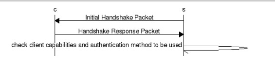
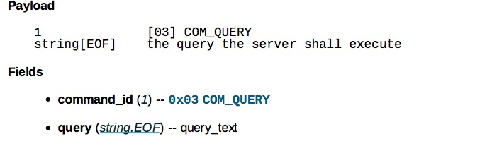
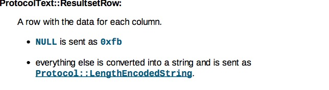
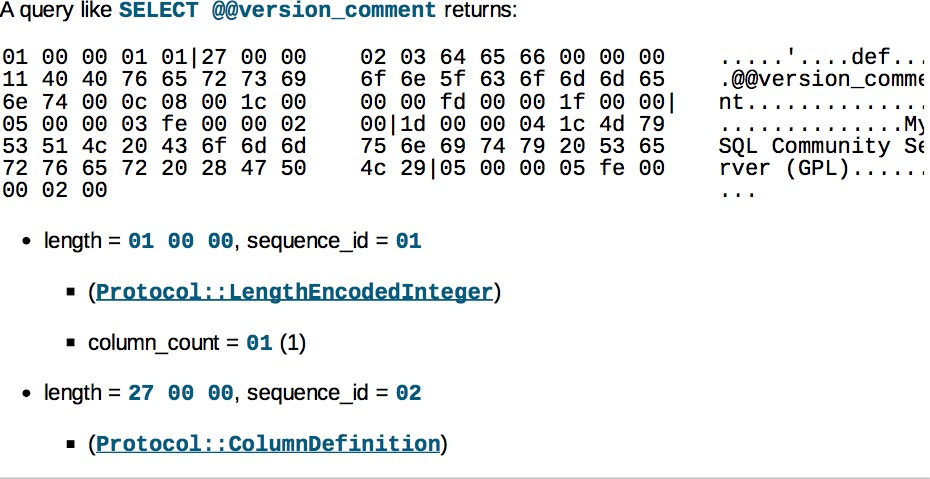
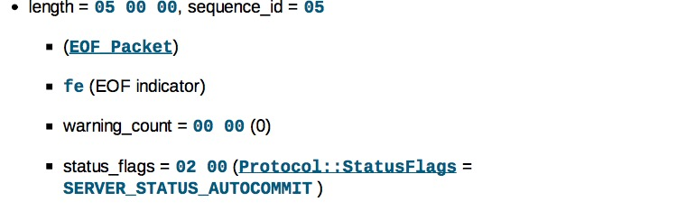

# 前言 
 MySQLPacket报文解析 一 这篇文章我们分析了MySQLPacket中字段和方法,接下来我们就来看看 mysql的报文 mycat是如何实现的.
 


# OK报文
	
1. 报文结构如图:

	
2. read 方法实现:
	1. 首先处理报文头的读取 ,代码如下:
			
		```
		packetLength = (int) buffer.readFixInt(3);
		packetId = buffer.readByte();
		```
	2. 接下来读取报文体.代码如下:

		```
		// ok_packet报文header为1个字节, 00或者fe
		fieldCount = buffer.readByte();
		// 影响行数, int<lence>
		affectedRows = buffer.readLenencInt();
		// 插入的id, int<lence>
		insertId = buffer.readLenencInt();
		// 固定长度 2 
		serverStatus = (int) buffer.readFixInt(2);
		// 固定长度 2 
		warningCount = (int) buffer.readFixInt(2);
		// 如果有未读取的,则说明有 info要处理,读取之. 
		if (index + packetLength + MySQLPacket.packetHeaderSize - buffer.readIndex > 0) {
			int msgLength = index + packetLength + MySQLPacket.packetHeaderSize - buffer.readIndex;
			this.message = buffer.getBytes(buffer.writeIndex, msgLength);
			buffer.readIndex += msgLength;
		}
		```
		
		其中readLenencInt是处理长度不固定的int,代码如下:
		
		```
		public long readLenencInt() {
			int index = readIndex;
			long len = getInt(index, 1) & 0xff;
			if (len < 251) {
				readIndex += 1;
				return getInt(index, 1);
			} else if (len == 0xfc) {
				readIndex += 2;
				return getInt(index + 1, 2);
			} else if (len == 0xfd) {
				readIndex += 3;
				return getInt(index + 1, 3);
			} else {
				readIndex += 8;
				return getInt(index + 1, 8);
			}
		}
	
		public long getInt(int index, int length) {
			buffer.position(index);
			long rv = 0;
			for (int i = 0; i < length; i++) {
				byte b = buffer.get();
				rv |= (((long) b) & 0xFF) << (i * 8);
			}
			return rv;
		}
		```
			
		> 关于int值的读取在MySQLPacket报文解析一 中有解释.
			
	3. calcPacketSize 方法的实现:
		
		```
		public int calcPacketSize() {
			// ok_packet报文header为1个字节
			int i = 1;
			// 长度不定
			i += BufferUtil.getLength(affectedRows);
			// 长度不定
			i += BufferUtil.getLength(insertId);
			// serverStatus + warningCount = 4 
			i += 4;
			// message 不一定有,需要进行判断
			if (message != null) {
				i += BufferUtil.getLength(message);
			}
			return i;
		}
		```
			
# ErrorPacket 
1. 报文结构如图:
		
	
	因此ErrorPacket有如下字段:
		
	```
private static final byte SQLSTATE_MARKER = (byte) '#';
    private static final byte[] DEFAULT_SQLSTATE = "HY000".getBytes();
	
	 // 恒为0xFF,int<1>
    public byte pkgType = MySQLPacket.ERROR_PACKET;
    // int<2>
    public int errno;
    // 恒为 # , string<1>
    public byte mark = SQLSTATE_MARKER;
    //  string<5>
    public byte[] sqlState = DEFAULT_SQLSTATE;
    // 不固定长度,以 EOF 结尾.
    public String message;
	```
2. read 方法实现:
	
	```
	public void read(ProxyBuffer byteBuffer) {
		 //  包头固定长度
        packetLength =(int) byteBuffer.readFixInt(3);
        // 序列号哭的长度1 
        packetId =byteBuffer.readByte();
        // 恒为0xFF,int<1>
        pkgType =byteBuffer.readByte();
        // int<2>
        errno = (int) byteBuffer.readFixInt(2);
        // sql state
        if ((byteBuffer.writeIndex - byteBuffer.readIndex) >0 && (byteBuffer.getByte(byteBuffer.readIndex) == SQLSTATE_MARKER)) {
        	byteBuffer.skip(1);
            sqlState = byteBuffer.readBytes(5);
        }
        // 不定长string 
        message = byteBuffer.readNULString();
}
	```
3. calcPacketSize 方法的实现: 
	
	```
	 public int calcPacketSize() {
	 	  // pkgType + errno + mark + sqlState = 1 + 2 + 1 + 5 = 9 
        int size = 9;
        if (message != null) {
            size += message.length()+1;
            // 加1 是为了加上0x00(null)
        }
        return size;
    }
	```		

#  EOFPacket

1. 报文结构如图:
	
	
	
	因此有如下字段:
	
	```
	// 恒为 fe
	public byte pkgType = MySQLPacket.EOF_PACKET;
	public int warningCount;
	public int status = 2;
	```
2. read 方法实现:
	
	```
	public void read(ProxyBuffer buffer) {
		packetLength = (int) buffer.readFixInt(3);
		packetId = buffer.readByte();
		// 恒为 fe
		pkgType = (byte) buffer.readByte();
		// int<2>
		warningCount = (int) buffer.readFixInt(2);
		// int<2>
		status = (int) buffer.readFixInt(2);
	}
	```

3. calcPacketSize方法实现:

	```
	@Override
	public int calcPacketSize() {
		return 5;// 1+2+2;
	}
	```
	

# CommandPacket

1. 说明
	
	该类是对Text Protocol的一个实现.这些报文中的大多数都是 有 1个字节的command和 可选的参数.因此对其抽象为CommandPacket.
	
2. 由于这些报文是客户端发送给mysql的报文,因此mycat不对其进行解析,直接传到后台即可.故没有read方法，有write方法.代码如下:

	```
	private void write(ProxyBuffer buffer,int pkgSize) {
        buffer.writeFixInt(3,calcPacketSize());
        buffer.writeByte(packetId);
        buffer.writeByte(command);
        buffer.writeBytes(arg);
    }
	```
3. calcPacketSize方法实现:

	```
	@Override
    public int calcPacketSize() {
        return 1 + arg.length;
    }
	```
	
	
# FieldPacket

1. 报文结构如图:

	
	
	因此有如下字段:
	
	```
	private static final byte[] DEFAULT_CATALOG = "def".getBytes();
	// FILLER 字段, [00][00]
	private static final byte[] FILLER = new byte[2];

	// catalog  always "def"
	public byte[] catalog = DEFAULT_CATALOG;
	// Length Coded String
	public byte[] db;
	// Length Coded String
	public byte[] table;
	// Length Coded String
	public byte[] orgTable;
	// Length Coded String
	public byte[] name;
	// Length Coded String
	public byte[] orgName;
	// int<2>
	public int charsetIndex;
	// int<4>
	public long length;
	// int<1>
	public int type;
	// int<2>
	public int flags;
	// int<1>
	public byte decimals;
	// defaultValues
	public byte[] definition;
	```
	
2. 	read 方法实现: 
	
	```
	public void read(byte[] data) {
		MySQLMessage mm = new MySQLMessage(data);
		this.packetLength = mm.readUB3();
		this.packetId = mm.read();
		readBody(mm);
	}
	
	private void readBody(MySQLMessage mm) {
		this.catalog = mm.readBytesWithLength();
		this.db = mm.readBytesWithLength();
		this.table = mm.readBytesWithLength();
		this.orgTable = mm.readBytesWithLength();
		this.name = mm.readBytesWithLength();
		this.orgName = mm.readBytesWithLength();
		// 不读取length of fixed-lengh field 恒为0c
		mm.move(1);
		this.charsetIndex = mm.readUB2();
		this.length = mm.readUB4();
		this.type = mm.read() & 0xff;
		this.flags = mm.readUB2();
		this.decimals = mm.read();
		// 跳过filter 恒为 [00][00]
		mm.move(FILLER.length);
		if (mm.hasRemaining()) {
			this.definition = mm.readBytesWithLength();
		}
	}
	```

3. calcPacketSize 方法:

	```
	public int calcPacketSize() {
		int size = (catalog == null ? 1 : BufferUtil.getLength(catalog));
		size += (db == null ? 1 : BufferUtil.getLength(db));
		size += (table == null ? 1 : BufferUtil.getLength(table));
		size += (orgTable == null ? 1 : BufferUtil.getLength(orgTable));
		size += (name == null ? 1 : BufferUtil.getLength(name));
		size += (orgName == null ? 1 : BufferUtil.getLength(orgName));
		size += 13;// 1+2+4+1+2+1+2
		if (definition != null) {
			size += BufferUtil.getLength(definition);
		}
		return size;
	}

	```
	
	其中 BufferUtil.getLength的方法如下:
	
	```
	 public static final int getLength(byte[] src) {
        int length = src.length;
        if (length < 251) {
            return 1 + length;
        } else if (length < 0x10000L) {
            return 3 + length;
        } else if (length < 0x1000000L) {
            return 4 + length;
        } else {
            return 9 + length;
        }
    }
	```
	
	> 该方法的实现对应着mysql报文中Length Coded 规则.在MySQLPacket报文解析一中有介绍.
	
	
# HandshakePacket

1. 报文结构:

	
	
	因此有如下字段:
	
	```
	 // capability flags upper 2 bytes + [00] + reserved =  2 + 1 + 10 = 13 
	private static final byte[] FILLER_13 = new byte[]{0, 0, 0, 0, 0, 0, 0, 0, 0, 0, 0, 0, 0};

	 // oa 
    public byte protocolVersion;
    // null string 
    public byte[] serverVersion;
    // int<4>
    public long threadId;
    // string<8> + filer = null string 
    public byte[] seed;
    // int<2>
    public int serverCapabilities;
    // int<1>
    public byte serverCharsetIndex;
    // int<2>
    public int serverStatus;
	 // 剩余的
    public byte[] restOfScrambleBuff;
	```

2. read 方法:

	```
	public void read(ProxyBuffer buffer) {
        packetLength = (int) buffer.readFixInt(3);
        packetId = buffer.readByte();
        // oa
        protocolVersion = buffer.readByte();
        // null string 
        serverVersion = buffer.readNULString().getBytes();
        // int<4>
        threadId = buffer.readFixInt(4);
        // string<8> + filer
        seed = buffer.readNULString().getBytes();
        // int<2>
        serverCapabilities = (int) buffer.readFixInt(2);
        // int<1>
        serverCharsetIndex = buffer.readByte();
        // int<2>
        serverStatus = (int) buffer.readFixInt(2);
        //  capability flags upper 2 bytes + [00] + reserved
        buffer.skip(13);
        // 剩余的
        restOfScrambleBuff = buffer.readNULString().getBytes();
    }
	```

3. calcPacketSize,代码如下:

	```
	 public int calcPacketSize() {
        int size = 1;
        size += serverVersion.length;// n
        size += 5;// 1+4 threadId + string 的null (占1字节)
        size += seed.length;// 8
        size += 19;// filler + serverCapabilities +  serverCharsetIndex  + serverStatus  + 13  = 1+2+1+2+13
        size += restOfScrambleBuff.length;// 12
        size += 1; // null 字节
        return size;
    }

	```
	
# AuthPacket

1. 说明
	mysql客户端登陆到mysql服务端需要一个交互的过程，首先服务端给客户端发送的初始握手包，客户端接收到握手包后向服务端返回认证包。如图:
	
	
2. 报文结构:

	
	
	因此有如下字段:
	
	```
	 private static final byte[] FILLER = new byte[23];

    public long clientFlags;
    public long maxPacketSize;
    public int charsetIndex;
    public byte[] extra;// from FILLER(23)
    public String user;
    public byte[] password;
    public String database;
	```
3. read 方法,代码如下:

```
public void read(ProxyBuffer byteBuffer) throws IOException {
        packetLength = (int) byteBuffer.readFixInt(3);
        packetId = byteBuffer.readByte();
        // int<4>
        clientFlags = byteBuffer.readFixInt(4);
        // int<4>
        maxPacketSize = byteBuffer.readFixInt(4);
        // int<1>
        charsetIndex = byteBuffer.readByte();
        // reserved always [0]
        byteBuffer.skip(23);
        // string[NUL] 
        user = byteBuffer.readNULString();
        // 密码
        password = byteBuffer.readLenencBytes();
        if ((clientFlags & Capabilities.CLIENT_CONNECT_WITH_DB) != 0) {
        // string[NUL]
            database = byteBuffer.readNULString();
        }
    }
```


4. calcPacketSize,代码如下:

	```
	@Override
    public int calcPacketSize() {
        int size = 32;//4+4+1+23;
        size += (user == null) ? 1 : user.length() + 1;
        size += (password == null) ? 1 : BufferUtil.getLength(password);
        size += (database == null) ? 1 : database.length() + 1;
        return size;
    }
	```
	
# QueryPacket

1. 报文结构

	
	
	因此有如下字段:
	
	```
	 public String sql;
    private byte pkgType = MySQLPacket.COM_QUERY;
	```
2. calcPacketSize方法:

	```
	 public int calcPacketSize() {
	 	// COM_QUERY 为一个字节
        return sql.length() + 1;
    }
	```

3. write 方法:
	
	```
	 public void write(ProxyBuffer buffer) {
        buffer.writeFixInt(3, calcPacketSize());
        buffer.writeByte(packetId);
        buffer.writeByte(pkgType);
        buffer.writeFixString(sql);
    }
	```


# RowDataPacket

1. 说明:
	
	RowDataPacket属于服务端返回ResultSet时的其中一部分包，用于描述结果集的行记录。
	
	报文结构如下:
	
	
	
	因此有如下字段:
	
	```
	 private static final byte NULL_MARK = (byte) 251;
    private static final byte EMPTY_MARK = (byte) 0;
    public int fieldCount;
    public final List<byte[]> fieldValues;
	```
	
   > 注意,该类只有在MycatShowConfigsCmd中有用到, MycatShowConfigsCmd是mycat管理命令处理类，用于查询当前配置信息.
   

2. read 方法:

	```
	 public void read(byte[] data) {
        MySQLMessage mm = new MySQLMessage(data);
        packetLength = mm.readUB3();
        packetId = mm.read();
        for (int i = 0; i < fieldCount; i++) {
            fieldValues.add(mm.readBytesWithLength());
        }
    }
	```

3. calcPacketSize方法:
	
	```
	    @Override
	    public int calcPacketSize() {
	        int size = 0;
	        for (int i = 0; i < fieldCount; i++) {
	            byte[] v = fieldValues.get(i);
	            size += (v == null || v.length == 0) ? 1 : BufferUtil.getLength(v);
	        }
	        return size;
	    }
	```

4. 使用场景分析:

	在io.mycat.mycat2.cmds.manager.MycatShowConfigsCmd#procssSQL中,通过实例化RowDataPacket,把 配置文件的信息 写入到结果中.代码如下:
	
	```
for (ConfigEnum configEnum : ConfigEnum.values()) {
		Configurable confValue = conf.getConfig(configEnum);
		if (confValue == null) {
			continue;
		}
		RowDataPacket row = new RowDataPacket(FIELD_COUNT);
		row.add(configEnum.name().getBytes());
		row.add(Integer.toString(conf.getConfigVersion(configEnum)).getBytes());
		row.add(format.format(conf.getConfigUpdateTime(configEnum)).getBytes());
		row.add(YamlUtil.dump(confValue).getBytes());
		row.packetId = ++packetId;
		row.write(buffer);
    }
	```
	
# ResultSetHeaderPacket

1. 报文结构
	
	
	
	
	由于该类是为了实现column_count,因此有如下字段:
	
	```
	public int fieldCount;
    public long extra;
	```
2.	read 方法:

	```
	  public void read(byte[] data) {
        MySQLMessage mm = new MySQLMessage(data);
        this.packetLength = mm.readUB3();
        this.packetId = mm.read();
        this.fieldCount = (int) mm.readLength();
        if (mm.hasRemaining()) {
            this.extra = mm.readLength();
        }
    }
	```
	
3. calcPacketSize 代码如下:

	```
	public int calcPacketSize() {
        int size = BufferUtil.getLength(fieldCount);
        if (extra > 0) {
            size += BufferUtil.getLength(extra);
        }
        return size;
    }
	```

# resultset报文实现

1. resultset 报文是个复合报文,由5部分组成.在mycat中MycatShowConfigsCmd有对其进行封装使用的案例. 我们就来看一下.

2. 首先在该类中初始化时声明了ResultSetHeaderPacket,FieldPacket,EOFPacket 返回字段的总数为4个,字段名称分别为 name,version,lastUpdateTime,content.代码如下:

	```
	private static final int FIELD_COUNT = 4;
    private static final ResultSetHeaderPacket header = PacketUtil.getHeader(FIELD_COUNT);
    private static final FieldPacket[] fields = new FieldPacket[FIELD_COUNT];
    private static final EOFPacket eof = new EOFPacket();

    static {
        int i = 0;
        byte packetId = 0;
        header.packetId = ++packetId;

        fields[i] = PacketUtil.getField("name", Fields.FIELD_TYPE_VAR_STRING);
        fields[i++].packetId = ++packetId;

        fields[i] = PacketUtil.getField("version", Fields.FIELD_TYPE_INT24);
        fields[i++].packetId = ++packetId;

        fields[i] = PacketUtil.getField("lastUpdateTime", Fields.FIELD_TYPE_LONG);
        fields[i++].packetId = ++packetId;

        fields[i] = PacketUtil.getField("content", Fields.FIELD_TYPE_VAR_STRING);
        fields[i++].packetId = ++packetId;

        eof.packetId = ++packetId;
    }
	
	```
	
	> 注意: 这里由于每个包都是分开的,所以packetId是递增的.
	
3. 在向客户端写出时,会调用procssSQL方法.代码如下:


	```
	  public boolean procssSQL(MycatSession session) throws IOException {
        ProxyBuffer buffer = session.proxyBuffer;
        buffer.reset();
        // write header
        header.write(buffer);

        // write fields
        for (FieldPacket field : fields) {
            field.write(buffer);
        }

        // write eof
        eof.write(buffer);

        // write rows
        byte packetId = eof.packetId;
		MycatConfig conf = ProxyRuntime.INSTANCE.getConfig();

		DateFormat format = new SimpleDateFormat(DATE_FORMAT);
		for (ConfigEnum configEnum : ConfigEnum.values()) {
			Configurable confValue = conf.getConfig(configEnum);
			if (confValue == null) {
				continue;
			}
			RowDataPacket row = new RowDataPacket(FIELD_COUNT);
			row.add(configEnum.name().getBytes());
			row.add(Integer.toString(conf.getConfigVersion(configEnum)).getBytes());
			row.add(format.format(conf.getConfigUpdateTime(configEnum)).getBytes());
			row.add(YamlUtil.dump(confValue).getBytes());
			row.packetId = ++packetId;
			row.write(buffer);
        }

        // write last eof
        EOFPacket lastEof = new EOFPacket();
        lastEof.packetId = ++packetId;
        lastEof.write(buffer);

        buffer.flip();
        buffer.readIndex = buffer.writeIndex;
        session.writeToChannel();
        return false;
    }
	```

4. 报文抓包分析(摘自MySQL-Internals-Manual.pdf).

	
	
	
	