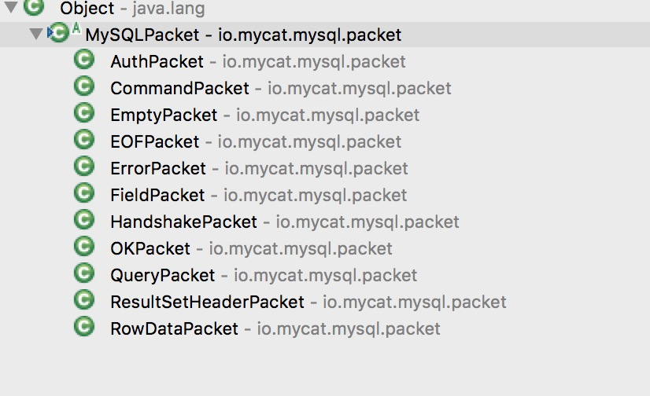

# 前言

mycat 做为mysql中间件,其对于mysql的报文处理是最重要的部分,那么我们就来看看mycat对于报文方面是如何处理的。


# mysql报文基本类型

1. MySQL报文中整型值分别有1、2、3、4、8字节长度，使用小字节序传输。
2. 字符串（以NULL结尾）字符串长度不固定，当遇到'NULL'（0x00）字符时结束。

3. 二进制数据（长度编码）（Length Coded Binary）
	数据长度不固定，长度值由数据前的1-9个字节决定，其中长度值所占的字节数不定，字节数由第1个字节决定，如下表：

	|第一个字节值|	后续字节数|	长度值说明|
	| --------   | -----:   | :----: |
	|0-250|	0	|第一个字节值即为数据的真实长度|
	|251	|0	|空数据，数据的真实长度为零|
	|252	|2	|后续额外2个字节标识了数据的真实长度|
	|253	|3	|后续额外3个字节标识了数据的真实长度|
	|254	|8	|后续额外8个字节标识了数据的真实长度|

4. 长度固定的字符串,字符串长度不固定，没有'NULL'（0x00）结束符，编码方式与上面的 Length Coded Binary 相同。

5. 报文结构
报文分为消息头和消息体两部分，其中消息头占用固定的4个字节，消息体长度由消息头中的长度字段决定，报文结构如下：

## MySQL报文结构


|类型| 名字| 描述|
| --------   | -----:   | :----: |
| int<3>        |payload长度      | 用于标记当前请求消息的实际数据长度值，以字节为单位，占用3个字节，**最大值为 0xFFFFFF，即接近 16 MB 大小（比16MB少1个字节）。**   |
|  int<1>	       | 序列号	   | 在一次完整的请求/响应交互过程中，用于保证消息顺序的正确，每次客户端发起请求时，序号值都会从0开始计算。   |
| string        | payload     |   报文体，长度即为前面指定的payload长度    |

# 分析

mycat对于mysql的报文处理都在io.mycat.mysql.packet中,其基类为MySQLPacket.结构图如下:



1. mysql通信报文结构

		  
	
	因此在MySQLPacket中有如下字段:
	
	```
	// payload长度 + 序列号 = 3 + 1 = 4
	public static int packetHeaderSize = 4;
	
	public int packetLength;
	public byte packetId;
	```

2. 由于mysql 中的ok报文 中第一个字节恒为 0x00 ,
	Error报文,值恒为0xFF,
		
3.  EOF结构用于标识Field和Row Data的结束，在预处理语句中，EOF	也被用来标识参数的结束。

	MySQL 4.0 及之前的版本:
		
	|字节|说明|
	| -----:   | :----: |
	| 1        |EOF值（0xFE）|
	
	MySQL 4.1 及之后的版本:
	
	|字节|说明|
	| -----:   | :----: |
	| 1       |EOF值（0xFE）|
	| 2       |告警计数|
	| 1       |状态标志位|
	
	因此在MySQLPacket中有如下字段:
	
	```
	public static final byte EOF_PACKET = (byte) 0xFE;
	public static final byte FIELD_EOF_PACKET = (byte) 0xFE;
	public static final byte ROW_EOF_PACKET = (byte) 0xFE;
	
	```
4.  前端报文处理:


|类型|命令|功能|mycat对应字段|
| -----:   | :----: | :----: | :----: |
| 0x00    |COM_SLEEP|（内部线程状态）| public static final byte COM_SLEEP = 0;|
| 0x01    |COM_QUIT|关闭连接| public static final byte COM_QUIT = 1;|
| 0x02    |COM_INIT_DB|切换数据库|public static final byte COM_INIT_DB = 2;|
| 0x03    |COM_QUERY|SQL查询请求|public static final byte COM_QUERY = 3;|
| 0x04    | COM_FIELD_LIST |获取数据表字段信息|public static final byte COM_FIELD_LIST = 4;|
| 0x05    | COM_CREATE_DB |创建数据库|public static final byte COM_CREATE_DB = 5;|
| 0x06    | COM_DROP_DB |删除数据库|public static final byte COM_DROP_DB = 6;|	
| 0x07    | COM_REFRESH |清除缓存|public static final byte COM_REFRESH = 7;|	
| 0x08    | COM_SHUTDOWN |停止服务器|public static final byte COM_SHUTDOWN = 8;|		
| 0x09    | COM_STATISTICS |获取服务器统计信息|public static final byte COM_STATISTICS = 9;|
| 0x0A    | COM_PROCESS_INFO |获取当前连接的列表|public static final byte COM_PROCESS_INFO = 10;|			
| 0x0B    | COM_CONNECT |内部线程状态|public static final byte COM_CONNECT = 11;|
| 0x0C    | COM_PROCESS_KILL |中断某个连接|public static final byte COM_PROCESS_KILL = 12;|
| 0x0D    | COM_DEBUG |保存服务器调试信息|public static final byte COM_DEBUG = 13;|
| 0x0E    | COM_PING |测试连通性|public static final byte COM_PING = 14;|	
|0x0F	|COM_TIME|（内部线程状态）|（无）|public static final byte COM_TIME = 15;|
|0x10	|COM_DELAYED_INSERT|（内部线程状态）|public static final byte COM_DELAYED_INSERT = 16;|
|0x11	|COM_CHANGE_USER|重新登陆（不断连接）|public static final byte COM_CHANGE_USER = 17;|
|0x12	|COM_BINLOG_DUMP|获取二进制日志信息|public static final byte COM_BINLOG_DUMP = 18;|
|0x13	|COM_TABLE_DUMP	|获取数据表结构信息	|public static final byte COM_TABLE_DUMP = 19;|
|0x14	|COM_CONNECT_OUT	| used by slave to log connection to master|public static final byte COM_CONNECT_OUT = 20;|
|0x15	|COM_REGISTER_SLAVE	|从服务器向主服务器进行注册|public static final byte COM_REGISTER_SLAVE = 21;|
|0x16	|COM_STMT_PREPARE|预处理SQL语句|	public static final byte COM_STMT_PREPARE = 22;|
|0x17	|COM_STMT_EXECUTE|执行预处理语句|	public static final byte COM_STMT_EXECUTE = 23;|
|0x18|	COM_STMT_SEND_LONG_DATA	|发送BLOB类型的数据|public static final byte COM_STMT_SEND_LONG_DATA = 24;|
|0x19|	COM_STMT_CLOSE|	销毁预处理语句|	public static final byte COM_STMT_CLOSE = 25;|
|0x1A|	COM_STMT_RESET|	清除预处理语句参数缓存|	public static final byte COM_STMT_RESET = 26;|
|0x1B|	COM_SET_OPTION|	设置语句选项|	public static final byte COM_SET_OPTION = 27;|
|0x1C|	COM_STMT_FETCH|	获取预处理语句的执行结果|public static final byte COM_STMT_FETCH = 28;|
|0x1d|	COM_DAEMON|服务器内部状态|public static final byte COM_DAEMON = 29;|
|0x1d|	COM_DAEMON|服务器内部状态|public static final byte COM_DAEMON = 29;|
|0x1e|	COM_BINLOG_DUMP_GTID|COM_BINLOG_DUMP_GTID报文的第一个字节|public static final byte COM_BINLOG_DUMP_GTID = 30;|
|0x1f|	COM_RESET_CONNECTION|重置session的状态,比COM_CHANGE_USER更轻量级|public static final byte COM_RESET_CONNECTION = 31;|
|0x1f|	COM_RESET_CONNECTION|重置session的状态,比COM_CHANGE_USER更轻量级|public static final byte COM_RESET_CONNECTION = 31;|


5. 声明了计算数据包大小和取得报文头的抽象方法,声明如下:

	```
	/**
	 * 计算数据包大小，不包含包头长度。
	 */
	public abstract int calcPacketSize();

	/**
	 * 取得数据包信息
	 */
	protected abstract String getPacketInfo();
	```