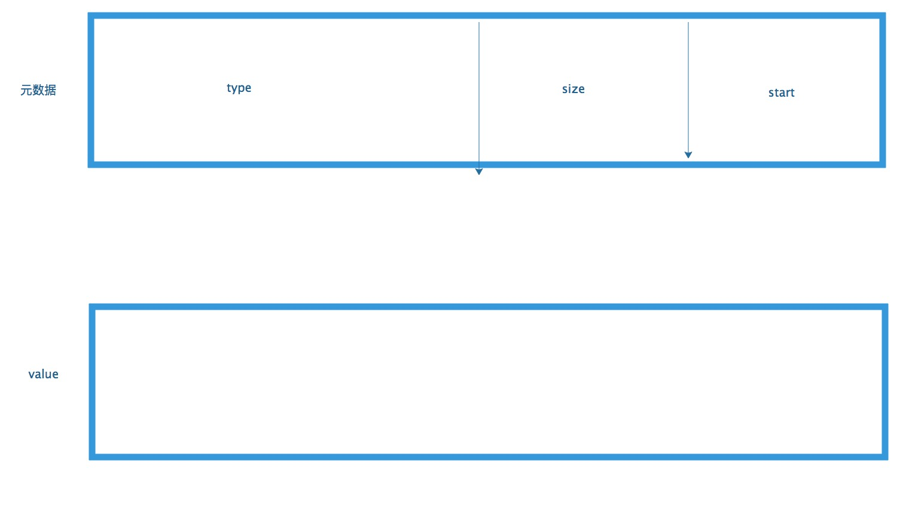

# 前言

在mycat2.0中的语句解析中时不时的会看到hasharray的身影,那么它到底有什么作用?我们就来看一下


# 分析

## 内存模型

HashArray这个类内部有如下字段:

```
  long[] hashArray;
  int pos = 0;
```

该类从功能上就是一个hash.存放值时 pos 指针移动两位,移动第一位是为了存放 'key',以就是元数据,移动第二位是为了存放 value.代码如下:

```
public void set(int type, int start, int size) {
	hashArray[pos++] = (long)type << 32 | size << 16 | start; pos++; 
}
	
public void set(int type, int start, int size, long hash) {
	 hashArray[pos++] = (long)type << 32 | size << 16 | start; hashArray[pos++] = hash; 
}
```

又是位操作什么的,表示看不懂啊,我们以图片来说明一下.




## 方法解析

在HashArray中有对元数据,value进行操作的方法.我们就一个个的解释一下.

1. 方法声明如下:

	```
	public void set(int type, int start, int size, long hash) 
	{ 	
		hashArray[pos++] = (long)type << 32 | size << 16 | start; hashArray[pos++] = hash; 
	}
	```
	
	由之前的图可以看到,元数据是由type,size,start三部分组成.因此我们取type的32位,size的低16位, 而 start 部分是用低64位表示的.如上图所示.


2. getPos方法声明如下：

	```
	 public int getPos(int idx) { return (((int)hashArray[idx<<1]) & 0xFFFF); }
	```
	
	0xFFFF 表示二进制为 1111111111111111.
	与hashArray[idx<<1] 进行 与 运算是为了取得hashArray[idx<<1]中的低16位.即pos.


3.  getSize方法声明如下:

	```
	public int getSize(int idx) 
	{ 
		return (((int)hashArray[idx<<1]&0xFFFF0000) >>> 16); 
	}
	```
	
	0xFFFF0000 二进制表示为  11111111111111110000000000000000,将hashArray[idx<<1] 强转为 int后 获得 低32位,进行与运算后得到 图中表示为 size的部分 . 但是值被放大了,因此进行右移16位.


4. gatType 方法声明如下:

	```
	public int getType(int idx) { return (int)((hashArray[idx<<1]&0xFFFFFFFF00000000L) >>> 32); }
	```
	0xFFFFFFFF00000000L 二进制表示为 1111111111111111111111111111111100000000000000000000000000000000
	
	进行与运算后得到高32位,然后右移32位得到type.
	
5.  getHash方法如下:

	```
	public long getHash(int idx) { return hashArray[(idx<<1)+1]; }
	```	
	
	idx<<1 是为了取得元数据的下标,加1即得到 value的下标 很easy.

6. getCount方法如下:

	```
	public int getCount() {return pos>>1;}
	```	
	
	由于我们是用2个元素进行表示的.那么获取数据个数自然要缩小1倍了.so easy.