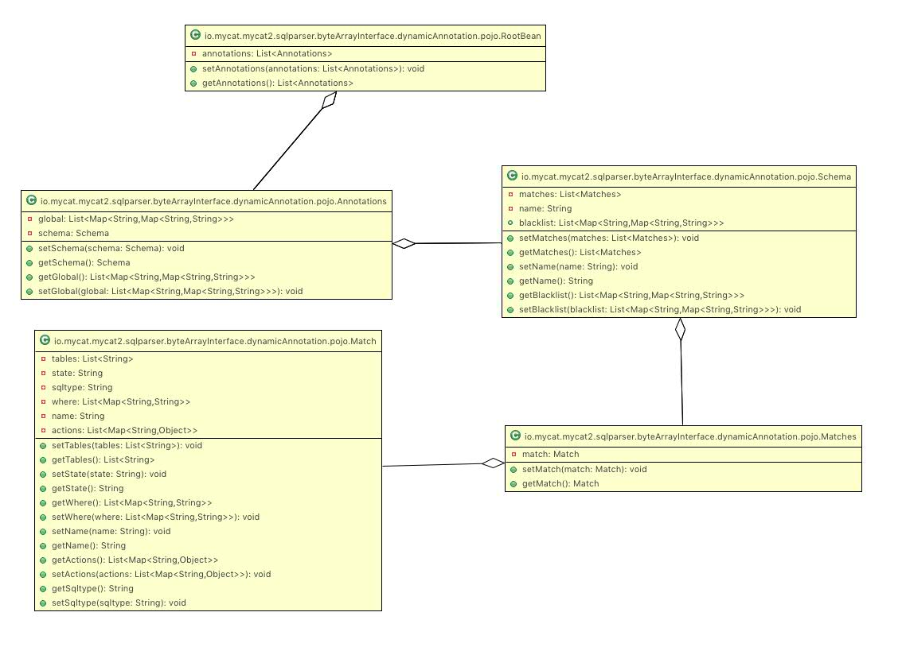
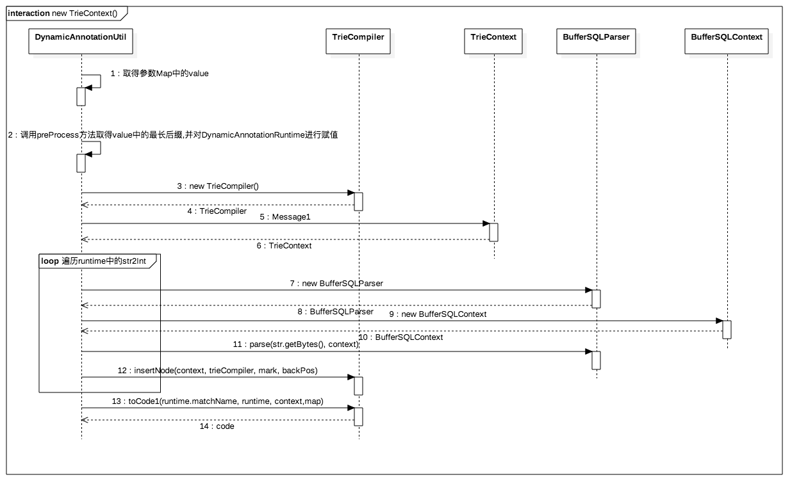
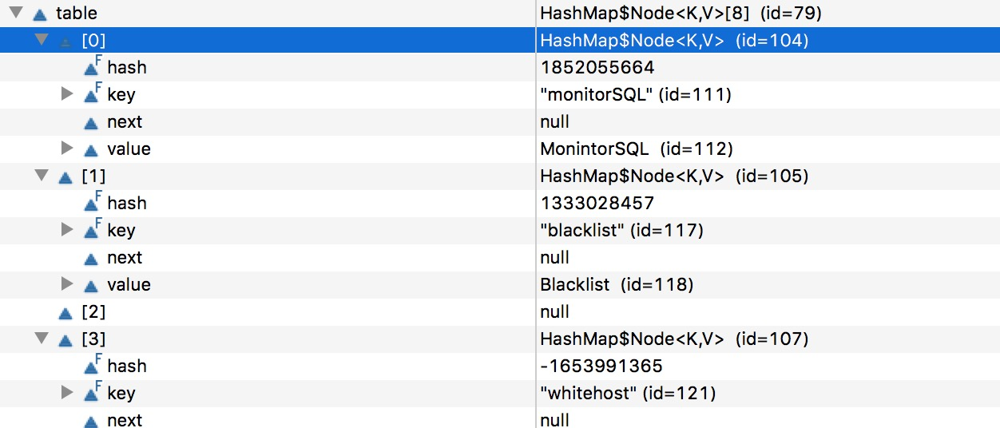

# 前言 

在mycat2.0中,关于AnnotationChain是一个很重要的模块,在处理前端请求时需要构建SQLAnnotationChain进行处理.在处理过程中又包含了DynamicAnnotationManager.Annotation的配置又是通过actions.yml,annotations.yml完成的,不可谓不复杂.


# 分析

## 配置文件

DynamicAnnotationManager 设计到的配置文件分别为actions.yml:
对应的实体为ActonFactory的HashMap<String, Class<SQLAnnotation>> resMap 结构.

```
actions:
      - monitorSQL: io.mycat.mycat2.sqlannotations.MonintorSQL
      - cacheResult: io.mycat.mycat2.sqlannotations.CacheResult
      - blacklist: io.mycat.mycat2.sqlannotations.Blacklist
      - whitehost: io.mycat.mycat2.sqlannotations.Whitehost
      - tableCheck: io.mycat.mycat2.sqlannotations.TableCheck
      - selelctAllow: io.mycat.mycat2.sqlannotations.blackList.SelelctAllow
      - deleteAllow: io.mycat.mycat2.sqlannotations.blackList.DeleteAllow
      - dropAllow: io.mycat.mycat2.sqlannotations.blackList.DropAllow
      - alterAllow: io.mycat.mycat2.sqlannotations.blackList.AlterAllow
      - truncateAllow: io.mycat.mycat2.sqlannotations.blackList.TruncateAllow
      - insertAllow: io.mycat.mycat2.sqlannotations.blackList.InsertAllow
      - updateAllow: io.mycat.mycat2.sqlannotations.blackList.UpdateAllow
      - replaceAllow: io.mycat.mycat2.sqlannotations.blackList.ReplaceAllow
      - createTableAllow: io.mycat.mycat2.sqlannotations.blackList.CreateTableAllow

```

annotations.yml,对应的实体类为RootBean:


```
annotations:
     - global:
          - monitorSQL: false        # 全局sql 监控 开关。 sql 监控属于环绕类 监控，需要获取到sql 执行时间等信息。
          - blacklist:
             - selelctAllow: true         # sql 拦截     属于前置处理类
             - tableCheck: true
          - whitehost:
               user: root
               host: 127.0.0.1
     - schema:
              name: test
              blacklist:   # 覆盖全局配置
                     - deleteAllow : false
              matches:
                      - match:
                             name: select有条件and or有tables
                             state: open
                             sqltype: select
                             where:
                                  - and: WHERE
                                  - or:  id = ?
                             tables:
                                  - test1
                             actions:
                                  - cacheResult:
                                      cache_time: 1800
                                      access_count: 60
                                      
                                      ....

```


RootBean类图如下:




## DynamicAnnotationManager初始化

1.  DynamicAnnotationManager的类图如下:

	
	
	
	DynamicAnnotationManagerImpl 调用链如图所示:
	
	
	
	 由调用链可知在AnnotationProcessor#init中初始化了DynamicAnnotationManagerImpl,构造器传入的参数为actions.yml,annotations.yml.代码如下:
	 
	 ```
	 	private static final String ACTIONS_PATH = "actions.yml";
	    private static final String ANNOTATIONS_PATH = "annotations.yml";
	 
	    private static void init() {
	        DynamicAnnotationManager manager = null;
	        try {
	            manager = new DynamicAnnotationManagerImpl(ACTIONS_PATH, ANNOTATIONS_PATH);
	        } catch (Exception e) {
	            e.printStackTrace();
	        }
	        if (manager != null) {
	            dynamicAnnotationManager.set(manager);
	        }
	    }
	 ```

2. DynamicAnnotationManagerImpl构造器有又调用了DynamicAnnotationManagerImpl(String actionsPath, String annotationsPath, Map<Integer, DynamicAnnotation[]> cache) 构造器.在该方法中做了如下5件事:
 	
 1. 初始化ActonFactory
 2. 初始化Map<String, SQLAnnotation> globalActionList.
 3. 初始化DynamicAnnotationKeyRoute
 3. 初始化SQLAnnotationList,并调用setSqlAnnotations赋值.
 5. 对DynamicAnnotationManagerImpl的cache进行赋值	
 ```
   public DynamicAnnotationManagerImpl(String actionsPath, String annotationsPath, Map<Integer, DynamicAnnotation[]> cache) throws Exception {
       try {
           ActonFactory actonFactory = new ActonFactory(actionsPath);
           Map<String, SQLAnnotation> globalActionList = new HashMap<>();
           this.route = new DynamicAnnotationKeyRoute(AnnotationsYamlParser.parse(annotationsPath, actonFactory, schemaWithSQLtypeFunction, globalActionList));
           SQLAnnotationList global = new SQLAnnotationList();
           global.setSqlAnnotations(globalActionList.values().stream().collect(Collectors.toList()));
           globalSQLAnnotationList = global;
           this.cache = cache;
       }catch (Exception e){
           e.printStackTrace();
           logger.error("动态注解语法错误");
           throw e;
       }
    }
 ```
 
 
2.1 在ActonFactory的构造器中,主要就是加载actions.yml中配置的SQLAnnotation,并放入resMap(key为actions.yml中配置的key,value 为 SQLAnnotation)中.代码如下:
 
 ```
     public ActonFactory(String config) throws Exception {
        this.config = config.trim();
        URL url = ActonFactory.class.getClassLoader().getResource(config);
        if (url != null) {
            Yaml yaml = new Yaml();
            FileInputStream fis = new FileInputStream(url.getFile());
            Map<String, List<Map<String, String>>> obj = (Map<String, List<Map<String, String>>>) yaml.load(fis);
            Map<String, String> actions = obj.values().stream().flatMap(maps -> maps.stream()).collect(Collectors.toMap(ConditionUtil::mappingKey, ConditionUtil::mappingValue));
            resMap = new HashMap<>(actions.size());
            for (Map.Entry<String, String> it : actions.entrySet()) {
                String value = it.getValue();
                if (value == null) continue;
                Class<SQLAnnotation> k = (Class<SQLAnnotation>) ActonFactory.class.getClassLoader().loadClass(value.trim());
                resMap.put(it.getKey().trim(), k);
            }
        }
    }
 ```
 
2.3 初始化DynamicAnnotationKeyRoute时,首先调用了AnnotationsYamlParser#parse进行解析annotations.yml.
该方法的处理逻辑如下,由于这部分比较复杂,我们将结合一个实例进行讲解:

 
 1. 加载annotations.yml,封装为RootBean.代码如下:
 	
 	```
 	 RootBean object = YamlUtil.load(annotationsPath, RootBean.class);

 	```
 
 2. 过滤得到annotations和global.调用scopeActionHelper进行global的初始化,然后放入2.2初始化的globalActionList中.代码如下:

 	```
  List<Annotations> annotations = object.getAnnotations().stream().filter((i) -> i.getGlobal() == null).collect(Collectors.toList());
    List<Annotations> global = object.getAnnotations().stream().filter((i) -> i.getGlobal() != null).collect(Collectors.toList());
    List<Map<String, Map<String, String>>> globalFun;
    if (global.size() == 1) {
        globalFun = global.get(0).getGlobal();
    } else {
        globalFun = Collections.EMPTY_LIST;
    }
    globalActionList.putAll(scopeActionHelper("global", globalFun, actonFactory));
 	```
 	
 	在scopeActionHelper中通过遍历annotations.yml中配置的global选项调用actonFactory#getActionByActionName获得SQLAnnotation.封装成Map<String, SQLAnnotation>进行返回.代码如下:
 	
 	```
 	private static Map<String, SQLAnnotation> scopeActionHelper(String matchName, List<Map<String, Map<String, String>>> list, ActonFactory actonFactory) {
        if(list==null){return Collections.EMPTY_MAP;}
        return list.stream().collect(Collectors.toMap((g) -> ConditionUtil.mappingKey(g), (g) -> {
            try {
                String name = ConditionUtil.mappingKey(g);
                return actonFactory.getActionByActionName(name, g.get(name));
            } catch (Exception e) {
                e.printStackTrace();
            }
            return null;
        }));
    }
 	```
 	
 	ActonFactory#getActionByActionName处理逻辑如下:
 	
 	1. args等于null时,初始化为HashMap.限于当annotations.yml中的global下的配置没有配置值.如:

 		```
 		annotations:
	     - global:
	          - monitorSQL: 
 		```
		> 不过好像不可以.语法就过不去....
	2. 从resMap中获得对应的class,通过反射进行初始化,调用init方法.

	3. 举例: 
		
		在annotations.yml中我们配置这如下代码:
		
		```
		annotations:
	     - global:
	          - monitorSQL: false
		```
		
		那么通过如上处理后,则会初始化在actions.yml中monitorSQL对应的io.mycat.mycat2.sqlannotations.MonintorSQL实例.并且调用其init方法.init方法如下:
		
		```
		public void init(Object args) {
			MonintorSQLMeta meta = new MonintorSQLMeta();
			setSqlAnnoMeta(meta);
		}
		
		public void setSqlAnnoMeta(SQLAnnotationMeta sqlAnnoMeta) {
			  this.sqlAnnoMeta = sqlAnnoMeta;
		}
		```
		其实很简单,初始化了MonintorSQLMeta,并赋值给了本类的sqlAnnoMeta.
		
3. 处理schema中的matches.处理逻辑如下:
	
	1. 从annotations中获得Schema,并依次遍历之.代码如下:

		```
		Iterator<Schema> iterator = annotations.stream().map((s) -> s.getSchema()).iterator();
        while (iterator.hasNext()) {
        	...
        }
		```
		
	2. 初始化schema下的blacklist.默认配置如下:
		
		
		
		代码如下:

		```
		Map<String, SQLAnnotation> schemaActionsList = scopeActionHelper(schemaName, schema.blacklist, actonFactory);
		```
		**通过之前的代码我们可以知道,初始化了Blacklist和DeleteAllow.**
		
		> 具体过程可参考2.3.2.3 的分析进行查看.
		
	3. 过滤出属于以下情况的match,不进行处理.
		
		1. state等于null
		2. state不为'OPEN'
		3. 对应的actions为空
		4. sqltype等于null的
  
    4.  初始化DynamicAnnotationKey.
	
	5. 针对match中有无配置where属性做不同处理,如果where属性有配置,则进行第6步;否则进行第7步.
	6. 针对where的处理如下:
	
		1. 根据where的配置初始化 Map<Boolean, List<Map<String, String>>>容器.代码如下:
	
			```
	        Map<Boolean, List<Map<String, String>>> map =
	        conditionList.stream().collect(Collectors.partitioningBy((p) -> {
	            String string = ConditionUtil.mappingKeyInAndOr(p).toUpperCase().trim();
	            return "AND".equals(string);
	        }));
			```
			
			举例:
				
			 假设where的配置如下:
			 
			 ```
	          where:
			      - and: WHERE
			      - or:  id = ?
			 ```
			 
			 则经过如上处理后, map的元素有:
			 
				  true --> [map<and, WHERE>]
				  
				  flse --> [map<or, id >]
			  
			  
		2. 初始化resMap容器.代码如下:

			```
			Map<Boolean, List<String>> resMap = new HashMap<>();
         resMap.put(Boolean.TRUE, map.get(Boolean.TRUE).stream().map((m) -> ConditionUtil.mappingValue(m)).distinct().collect(Collectors.toList()));
            resMap.put(Boolean.FALSE, map.get(Boolean.FALSE).stream().map((m) -> ConditionUtil.mappingValue(m)).distinct().collect(Collectors.toList()));
			```
			
		 3. 初始化DynamicAnnotationRuntime.
		 4.  初始化annotation.	
		 5.  放入table中.


		序列图如下:
		
		
	
		2.3.3.6.3  初始化DynamicAnnotationRuntime时调用了DynamicAnnotationUtil#compile方法.处理逻辑如下:
			
		 1. 生成java类名,类名是自增的.最终生成的类名为1.java,2.java之类的.
		 2. 调用genJavacode生成DynamicAnnotationRuntime
		 3. 调用compileJavaCodeToClass进行编译,生成的代码在classpath/cachefile 目录下.
		 4. loadClass加载.
		 
		代码如下:
	
		```
		public static DynamicAnnotationRuntime compile(String matchName,Map<Boolean, List< String>> lines) throws Exception {
		    String filename ="_" +count.getAndIncrement();
		    DynamicAnnotationRuntime runtime = genJavacode(filename, filename + ".java", lines);
		    compileJavaCodeToClass(runtime);
		    loadClass(runtime);
		    return runtime;
		}
		```
	
		2.3.3.6.3.2 genJavacode方法的处理逻辑如下:
			
		1. 初始化DynamicAnnotationRuntime,并设置MatchName.最终的MatchName为1.java,2.java之类的
		2. 调用DynamicAnnotationUtil#assemble生成code.
		3. 在/classpath/cachefile下,将生成的code 写到文件中,并将runtime的CodePath设置为 /classpath/cachefile/className.
	
	
	
		2.3.3.6.3.2.2   调用DynamicAnnotationUtil#assemble生成code这部分还是比较复杂的.序列图如下:
		
		
		
			
		 其中 序列图中的第二步 : 调用preProcess方法取得value中的最长后缀,并对DynamicAnnotationRuntime进行赋值. 在该步骤中找到公共后缀后,会对DynamicAnnotationRuntime中的int2str,str2Int,backtrackingTable(用于回溯) 进行赋值.
		 
		 
		 序列图中的第11步: 调用io.mycat.mycat2.sqlparser.BufferSQLParser#parse进行解析.该方法的讲解会在其后 集合案例 进行讲解.
		 
		 序列图中的第13步:  TrieCompiler#insertNode 是通过前缀树的方式进行插入的,关于这部分的内容,我们在 mycat 2.0 TrieCompiler TrieContext TrieKey 中 有进行讲解.这里不在赘述.
	
	
	
 7.  如果Match中没有配置where条件的.则通过io.mycat.mycat2.sqlparser.byteArrayInterface.dynamicAnnotation.DynamicAnnotationManagerImpl#getGlobalFunctionHash获得schemaName,sqlType对应的hash值.然后放入到schemaWithSQLtypeFunction中.
	 
 
 
 8. AnnotationsYamlParser#parse 处理完毕后,进入DynamicAnnotationKeyRoute的初始化. 处理逻辑如下:
		1. 遍历Map,该map是 DynamicAnnotationKey --> DynamicAnnotation的映射. 存入mapList(HashMap,Integer -->  List<DynamicAnnotation> 的映射) 中.
		2.  遍历mapList,将遍历得到的RouteMap放入到tablesRoute中. 

	 代码如下:
	 
	 ```
	  public DynamicAnnotationKeyRoute(Map<DynamicAnnotationKey, DynamicAnnotation> map) {
        HashMap<Integer, List<DynamicAnnotation>> mapList = new HashMap<>();
        for (Map.Entry<DynamicAnnotationKey, DynamicAnnotation> it : map.entrySet()) {
            int hash = hash(it.getKey().schemaName, it.getKey().sqlType);
            String[] tables = it.getKey().tables;
            if (tables == null || tables.length == 0) {//处理无tables的路由
                notablesRoute.compute(hash, (k, v) -> {
                    if (v == null) {
                        v = new ArrayList<>();
                    }
                    v.add(it.getValue());
                    return v;
                });
            } else {
                mapList.compute(hash, (k, v) -> {//处理有tables的路由
                    if (v == null) {
                        v = new ArrayList<>();
                    }
                    v.add(it.getValue());
                    return v;
                });
            }
        }
        for (Map.Entry<Integer, List<DynamicAnnotation>> it : mapList.entrySet()) {
            HashMap<int[], List<DynamicAnnotation>> m = new HashMap<>();
            List<DynamicAnnotation> list = it.getValue();
            for (DynamicAnnotation dynamicAnnotation : list) {
                int[] hash = stringArray2HashArray(dynamicAnnotation.key.tables);
                m.compute(hash, (k, v) -> {
                    if (v == null) v = new ArrayList<>();
                    v.add(dynamicAnnotation);
                    return v;
                });
            }
            RouteMap<List<DynamicAnnotation>> routeMap = new RouteMap<List<DynamicAnnotation>>(m);
            tablesRoute.put(it.getKey(), routeMap);
        }
    }
	 ```
	 
	 
	 > tablesRoute 是一个Integer-->RouteMap的映射.key 为schemaName加上sqlType的hash值. RouteMap呢? 则是对schemaName加上sqlType 对应的DynamicAnnotation 进行的包装.
	 
	 
	 至此 关于DynamicAnnotationManager的初始化我们就分析完了.下面我们将结合一个例子对AnnotationsYamlParser#parse 解析过程进行分析.
	 
	 
#  AnnotationsYamlParser#parse讲解
	 
1. 假如我们配置的annotations.yml就是默认的.annotations.yml内容在本文开篇有提到.那么我们此时就进入DynamicAnnotationManagerImpl#DynamicAnnotationManagerImpl中,此时传入的参数为 : actionsPath = actions.yml,annotationsPath = annotations.yml , cache  = 空集合.

2. 初始化ActonFactory,传入参数为 actions.yml. 在构造器中,对config赋值为  actions.yml, 对resMap 进行赋值.

3. 调用AnnotationsYamlParser#parse 进行解析.这是我们的重头戏. 传入的参数为annotations.yml, 新创建的,空schemaWithSQLtypeFunction, 空globalActionList .

	1. YamlUtil#load(annotations.yml,RootBean.class) 加载annotations.yml.

	2. 过滤得到annotations和global.调用scopeActionHelper进行global的初始化,然后放入globalActionList中.此时 globalActionList中的内容如下:
	
		
	

	3. 循环迭代Schema配置.很明显对于当前请况,Schema集合size 为1 。
	  
	 	1. 将Schema配置的blacklist放入到schemaActionsList中.结构如下:

	 		
	 	
	 	2. 遍历Schema的配置的match.对于当前场景,我们配置了6个.我们就拿第一个举例.即:

		 	```
		match:
		 name: select有条件and or有tables
		 state: open
		 sqltype: select
		 where:
		      - and: WHERE
		      - or:  id = ?
		 tables:
		      - test1
		 actions:
		      - cacheResult:
		          cache_time: 1800
		          access_count: 60
		 	```
		 	
		 	1.  根据 sqltype获得SQLType枚举,对于当前 为 SQLType.SELECT.
		 	
		 	2.  初始化DynamicAnnotationKey.

		 	3.  获得配置的where选项(即conditionList).根据where是否为空做不同的处理。对于当前场景, where 是不为空的.

		 	4. 将conditionList中按照key 是否等于AND 进行划分.很明显. 处理结束后,获得的结果为: 
		 	> {false=[{or=id = ?}], true=[{and=WHERE}]}
		 	
		   5. 将resMap 中按照TRUE,false 分别获得对应的条件,加入到resMap.此时 resMap 结果为:  
		   	
		   	 > {false=[id = ?], true=[WHERE]}
		   	 
		   	6.  调用 DynamicAnnotationUtil#compile(“select有条件and or有tables”, Map  lines ) // lines = {false=[id = ?], true=[WHERE]}

		   		1.  生成文件名. 格式为 “_”+ 自主id. 此时为 _0
		   		
		   		2.  调用genJavacode生成code,并返回DynamicAnnotationRuntime. 此时传入的参数为: 
		   		> className = “_0”，path = “_0.java”，lines == {false=[id = ?], true=[WHERE]}
		   		
		   		然后调用assemble,生成code.最后写入到/clsspath/cachefile下.
		   		3. 编译加载. 


此时我们方法的调用链如下:

```

--> DynamicAnnotationManagerImpl(String actionsPath, String annotationsPath, Map<Integer, DynamicAnnotation[]> cache) // actionsPath = actions.yml,annotationsPath = annotations.yml , cache  = 空集合.
		--> new ActonFactory(actionsPath); // actionsPath = actions.yml
				--> this.config = config.trim(); // this.config = actions.yml
				--> 遍历actions.yml中的配置项,加载配置的MonintorSQL,放入resMap中. 如 monitorSQL: io.mycat.mycat2.sqlannotations.MonintorSQL,会初始化MonintorSQL,放入resMap的key为monitorSQL,value为MonintorSQL类的实例.
		--> Map<String, SQLAnnotation> globalActionList = new HashMap<>(); // 存放Action的容器.
		
		--> AnnotationsYamlParser.parse(String, ActonFactory, Map<Integer, List<SQLAnnotationList>> schemaWithSQLtypeFunction , Map<String, SQLAnnotation> globalActionList) // String = annotations.yml,ActonFactory = 新创建的,schemaWithSQLtypeFunction 当前为空, globalActionList 为空.
		
				--> YamlUtil.load(annotations.yml, RootBean.class); // 加载RootBean.
				
				--> 过滤得到annotations和global.调用scopeActionHelper进行global的初始化,然后放入globalActionList中. 
				
				--> 循环迭代Schema配置.很明显对于当前请况,Schema集合size 为1 。
						
						--> 将Schema配置的blacklist放入到schemaActionsList中.
						
						--> 遍历Schema的配置的match.对于当前场景,我们配置了6个.我们就拿第一个举例
						
								--> 根据 sqltype获得SQLType枚举,对于当前 为 SQLType.SELECT.
								--> 初始化DynamicAnnotationKey
								--> 获得配置的where选项.根据where是否为空做不同的处理。对于当前场景, where 是不为空的.
								
								--> 将conditionList中按照key 是否等于AND 进行划分.处理结束后,获得的结果为: {false=[{or=id = ?}], true=[{and=WHERE}]}
								
								--> 将resMap 中按照TRUE,false 分别获得对应的条件,加入到resMap.此时 resMap 结果为:  {false=[id = ?], true=[WHERE]}
								
										--> 调用 DynamicAnnotationUtil#compile(“select有条件and or有tables”, Map<Boolean, List<String>> lines ) // lines = {false=[id = ?], true=[WHERE]}
										
												-->  生成文件名. 格式为 “_”+ 自主id. 此时为 _0
												
												--> genJavacode(String className, String path, Map<Boolean, List< String>> lines)	// 		className = “_0”，path = “_0.java”，lines == {false=[id = ?], true=[WHERE]}
														
														--> new DynamicAnnotationRuntime()
														--> assemble(lines, runtime); // lines = {false=[id = ?], true=[WHERE]}
														
														--> 写入到/clsspath/cachefile下
												
												--> 编译加载. 
```


---------------

DynamicAnnotationUtil#assemble 方法分析.

1. 此时我们传入的参数为 : 

	> lines = {false=[id = ?], true=[WHERE]} ,runtime 为新创建的.

2.  取得lines的value. 此时结果为 : [id = ?, WHERE]  

3. 调用 preProcess方法.传入参数为 list = [id = ?, WHERE] .该方法主要取得list 中字符的最长后缀,并对DynamicAnnotationRuntime进行赋值.	
		  
	1. 声明如下变量: 

		```
		// 关联
		 Map<String, Set<String>> relationTable = new HashMap<>();
		 // 回溯
	    Map<String, Integer> backtrackingTable = new HashMap<>();
	    // 当两个字符相等或者其实一个为? 返回true。否则返回false。	   	
	    BiFunction<String, String, Boolean> equal = (l, r) -> {
	        if (l.equals(r)) return true;
	        if (l.equals("?") || r.equals("?")) {
	            return true;
	        } else
	            return false;
	    };
		```
	
	2. 由于传入的参数为	[id = ?, WHERE]. 因此在进行回溯时,外循环 2 次 . 内循环 4 次. 我们只拿 当外循环到 id = ?,  内循环到 WHERE 时举例. 其他类似.

	
	3. 调用tokenize方法进行分析. 此时 传入的参数 依次为  id = ?，WHERE. 在该方法中首先将 传入参数转换为 字节数组. 然后调用BufferSQLParser# parse 进行解析.

	4. BufferSQLParser#parse 代码如下: 

		```
		public void parse(byte[] src,		BufferSQLContext context) {
        this.defaultByteArray.setSrc(src);
        sql = this.defaultByteArray;
        hashArray = context.getHashArray();
        hashArray.init();
        context.setCurBuffer(sql);
        tokenizer.tokenize(sql, hashArray);
        firstParse(context);
    }
		
		```
		
		
		其中关键点是为 :
		
		1. hashArray.init();

		2. tokenizer.tokenize(sql, hashArray);

		3. firstParse(context); 对于当前场景该方法不会进行处理.

		
		
		4.1 hashArray.init(). 该方法将hashArray中的数组初始为0.
		
		4.2 Tokenizer#tokenize(sql, hashArray) 主要是遍历sql中各字节的类型. 由于我们现在出传入的参数为 id = ? 的字节数组.并对每一个字节按照字符去处理.代码如下:
		
			
		```
		 public void tokenize(ByteArrayInterface sql, HashArray hashArray) {
	        int pos = sql.getOffset();
	        final int sqlLength = sql.length()+pos;
	        this.sql = sql;
	        this.hashArray = hashArray;
	        byte c;
	        byte cType;
	        byte next;
	        while (pos < sqlLength) {
	            c = sql.get(pos);
	            cType = charType[c<<1];
	
	            switch (cType) {
	                case 0:
	                    pos++;
	                    break;
	                case CHARS:
	                    pos = parseToken(sql, pos, sqlLength, c);
	                    break;
	               ....
	                default:
	                    hashArray.set(cType, pos++, 1);
	            }
	        }
	    }

		```
			
		由于字节数组第一个字节为 char,因此会调用parseToken. 方法如下:
		
		```
	 int parseToken(ByteArrayInterface sql, int pos, final int sqlLength, byte c) {
	        int cType;
	        int start = pos;
	        int size = 1;
	        long hash = c = charType[(c<<1)+1];
	        int type = 1315423911;
	        type ^= (type<<5) + c + (type>>2);
	        while (++pos < sqlLength && (((cType = charType[(c = sql.get(pos))<<1]) == 2) || cType == 1) ) {
	            cType = charType[(c<<1)+1];
	            hash = (hash*41)+cType;//别问我为什么是41
	            type ^= (type<<5) + cType + (type>>2);
	            size++;
	        }
	        hashArray.set(type, start, size, hash);
	        return pos;
	    }
		```	
			
		
		 > 可以看到该方法是遍历到不是 char 字节为止.因此遍历结束时,指针下标为2, 对应的值为 ”“. ”“ 对应的值为 0, 因此不会处理”“,转而处理 ”=“，”?“ , 又因为该方法 对于 ”=“，”?“ 的处理会调用  hashArray#set,  而方法我们在mycat2.0 hasharray 已经分析过了. 
		
			
4.  最后对 runtime 进行赋值.代码如下:

		```
		runtime.setInt2str(int2str); //  {0=id = ?, 1=WHERE}
	runtime.setMap(relationTable); // {id = ?=[id = ?], WHERE=[WHERE]}
	runtime.setStr2Int(str2Int);// {id = ?=0, WHERE=1}
	runtime.setBacktrackingTable(backtrackingTable)// {id = ?=0, WHERE=0}
		```
	


5. 	初始化TrieCompiler,TrieContext.


6. 遍历第4步中获得的str2Int,backtrackingTable. 调用insert进行插入. 对于当前场景 str2Int = {id = ?=0, WHERE=1},backtrackingTable = {id = ?=0, WHERE=0}.

7.  由于str2Int size 为 2 ,因此会依次传入 [id = ?, TrieCompiler,"0",0],[WHERE, TrieCompiler,"0",0] 参数.在该方法中还是调用了BufferSQLParser#parse ,该方法之前已经有说明了.最后调用 TrieCompiler#insertNode. 代码如下:

	```
	public static void insert(String str, TrieCompiler trieCompiler, String mark, int backPos) {
        BufferSQLParser parser = new BufferSQLParser();
        BufferSQLContext context = new BufferSQLContext();
        parser.parse(str.getBytes(), context);
        TrieCompiler.insertNode(context, trieCompiler, mark, backPos);
    }
	```


8. 在TrieCompiler#insertNode中 是将字符串的每个字符插入到前缀树中.如果遍历到字符串,则会调用doCallback方法. 代码如下:

	```
	 public static void doCallback(TrieCompiler head, String runnable) {
        if (head.callback == null) {
            head.callback = new HashSet<>();
        }
        head.callback.add(runnable);
    }
	```	
	
9. 当节点都插入到TrieCompiler中后,调用TrieCompiler#toCode1方法. 该方法 主要是遍历整颗树,然后生成代码.


DynamicAnnotationUtil#assemble 的调用栈如下:


```

--> 	assemble(Map<Boolean, List<String>> map, DynamicAnnotationRuntime runtime) // lines = {false=[id = ?], true=[WHERE]}

			--> 取得lines的value. 此时结果为 : [id = ?, WHERE]
			
					--> preProcess(List<String> list, DynamicAnnotationRuntime runtime) // list = [id = ?, WHERE]  
							// 目的: 取得list 中字符的最长后缀,并对DynamicAnnotationRuntime进行赋值.
							
							-->   声明如下变量: Map<String, Set<String>> relationTable  // 关联, Map<String, Integer> backtrackingTable // 回溯,BiFunction<String, String, Boolean> equal // 当两个字符相等或者其实一个为? 返回true。否则返回false。
							
							-->  由于传入的参数为	[id = ?, WHERE]. 因此在进行回溯时,外循环 2 次 . 内循环 4 次. 我们只拿 当外循环到 id = ?,  内循环到 WHERE 时举例. 其他类似.
							
										--> tokenize(String str) //传入的参数 依次为  id = ?，WHERE.
										
												--> str.getBytes(java.nio.charset.StandardCharsets.UTF_8);  
												
												-->  BufferSQLParser.parse(byte[] src, BufferSQLContext context) 
												
														--> HashArray#init();
														
														-->  Tokenizer2#tokenize  // 主要是遍历sql中各字节的类型. 由于我们现在出传入的参数为 id = ? 的字节数组.并对每一个字节按照字符去处理
														
														-->  firstParse(context); 
							-->	runtime.setInt2str(int2str); //  {0=id = ?, 1=WHERE}
					        runtime.setMap(relationTable); // {id = ?=[id = ?], WHERE=[WHERE]}
					        runtime.setStr2Int(str2Int);// {id = ?=0, WHERE=1} 
					        runtime.setBacktrackingTable(backtrackingTable);	// {id = ?=0, WHERE=0}	
					-->         TrieCompiler trieCompiler = new TrieCompiler();
        							TrieContext context = new TrieContext(); 					        
					        
					--> 	遍历第4步中获得的str2Int,backtrackingTable. 调用insert进行插入. 对于当前场景 str2Int = {id = ?=0, WHERE=1},backtrackingTable = {id = ?=0, WHERE=0 }
					
							-->    insert(String str, TrieCompiler trieCompiler, String mark, int backPos)    // 由于str2Int size 为 2 ,因此会依次传入 [id = ?, TrieCompiler,"0",0],[WHERE, TrieCompiler,"0",0] 参数.
					
									-->    TrieCompiler#insertNode.
							
			--> 	TrieCompiler#toCode1 	
```	


--------

1. 当annotations.yml,actions.yml 解析完毕后, 会进入DynamicAnnotationKeyRoute的构造器中. 
	
	1. 在该构造器中会遍历AnnotationsYamlParser#parse方法的返回值. 如果DynamicAnnotationKey中 没有配置tables,就会加入到notablesRoute中,否则加入到mapList(有tables的路由) .

	2. 遍历mapList 加入到tablesRoute中.

2.  代码回到了DynamicAnnotationManagerImpl中,然后进行剩余的初始化,关于该部分就是一些简单的赋值,代码如下:

	```
	  SQLAnnotationList global = new SQLAnnotationList();
global.setSqlAnnotations(globalActionList.values().stream().collect(Collectors.toList()));
   globalSQLAnnotationList = global;
   this.cache = cache;
	```
	