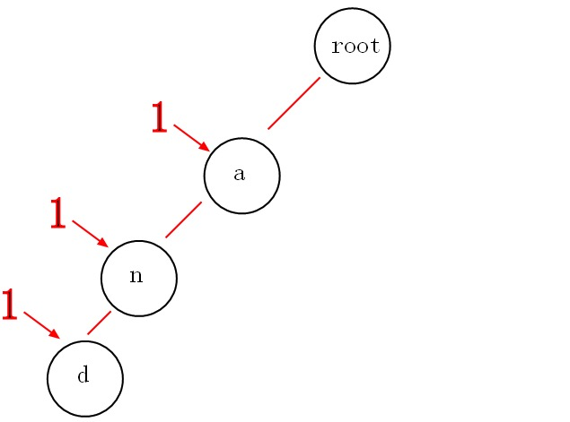
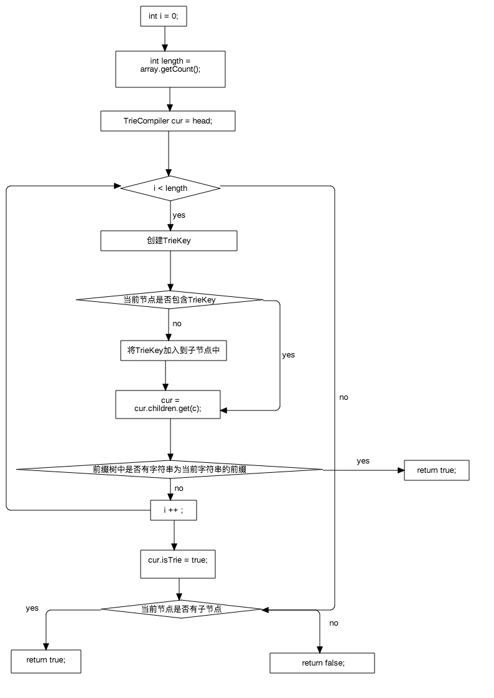

# 前言

DynamicAnnotationManager 在实例化需要读取annotations.yml,actions.yml ,其中annotations.yml在处理时是通过前缀树 进行实现的,这里还是很复杂的,那么何为前缀树,mycat2.0是如何实现的?我们就来看一下


# 前缀树

1. 概念

	我们有and,as,at,cn,com这些关键词，那么如何构建trie树呢？
	
	
	
	从上面的图中，我们或多或少的可以发现一些好玩的特性。

      第一：根节点不包含字符，除根节点外的每一个子节点都包含一个字符。

      第二：从根节点到某一节点，路径上经过的字符连接起来，就是该节点对应的字符串。

      第三：每个单词的公共前缀作为一个字符节点保存。
      
2. 使用场景
	
	第一：词频统计。
	
	可能有人要说了，词频统计简单啊，一个hash或者一个堆就可以打完收工，但问题来了，如果内存有限呢？还能这么玩吗？所以这里我们就可以用trie树来压缩下空间，因为公共前缀都是用一个节点保存的。

   第二: 前缀匹配
		
 就拿上面的图来说吧，如果我想获取所有以"a"开头的字符串，从图中可以很明显的看到是：and,as,at，如果不用trie树，

   你该怎么做呢？很显然朴素的做法时间复杂度为O(N2) ，那么用Trie树就不一样了，它可以做到h，h为你检索单词的长度，可以说这是秒杀的效果。

	举个例子：现有一个编号为1的字符串”and“，我们要插入到trie树中，采用动态规划的思想，将编号”1“计入到每个途径的节点中，那么以后我们要找”a“，”an“，”and"为前缀的字符串的编号将会轻而易举。
	

	

3. 实际操作

  1. 定义trie树节点
	  
	  	```
	        public class TrieNode
	        {
	            /// <summary>
	            /// 26个字符，也就是26叉树
	            /// </summary>
	            public TrieNode[] childNodes;
	
	            /// <summary>
	            /// 词频统计
	            /// </summary>
	            public int freq;
	
	            /// <summary>
	            /// 记录该节点的字符
	            /// </summary>
	            public char nodeChar;
	
	            /// <summary>
	            /// 插入记录时的编码id
	            /// </summary>
	            public HashSet<int> hashSet = new HashSet<int>();
	
	            /// <summary>
	            /// 初始化
	            /// </summary>
	            public TrieNode()
	            {
	                childNodes = new TrieNode[26];
	                freq = 0;
	            }
	        }
	        #endregion
	  	```
		
	
   2. 添加操作
   
   		```
  
        public void AddTrieNode(ref TrieNode root, string word, int id)
        {
            if (word.Length == 0)
                return;

            //求字符地址，方便将该字符放入到26叉树中的哪一叉中
            int k = word[0] - 'a';

            //如果该叉树为空，则初始化
            if (root.childNodes[k] == null)
            {
                root.childNodes[k] = new TrieNode();

                //记录下字符
                root.childNodes[k].nodeChar = word[0];
            }

            //该id途径的节点
            root.childNodes[k].hashSet.Add(id);

            var nextWord = word.Substring(1);

            //说明是最后一个字符，统计该词出现的次数
            if (nextWord.Length == 0)
                root.childNodes[k].freq++;

            AddTrieNode(ref root.childNodes[k], nextWord, id);
        }
        
   		```
   		
   	3.  删除操作

   		```
        public void DeleteTrieNode(ref TrieNode root, string word, int id)
        {
            if (word.Length == 0)
                return;

            //求字符地址，方便将该字符放入到26叉树种的哪一颗树中
            int k = word[0] - 'a';

            //如果该叉树为空,则说明没有找到要删除的点
            if (root.childNodes[k] == null)
                return;

            var nextWord = word.Substring(1);

            //如果是最后一个单词，则减去词频
            if (word.Length == 0 && root.childNodes[k].freq > 0)
                root.childNodes[k].freq--;

            //删除途经节点
            root.childNodes[k].hashSet.Remove(id);

            DeleteTrieNode(ref root.childNodes[k], nextWord, id);
        }
   		```


# mycat 实现 


1. mycat 关于 trie树 涉及的类如下:
	
	
	
	> 关于trie 树节点 对应的是 TrieKey. 此外由于mycat只存在插入操作,不存在删除的情况.因此我们只需观察 插入方法即可.


2. 插入操作实现. 

	mycat中关于trie树实现 是在io.mycat.mycat2.sqlparser.byteArrayView.dynamicAnnotation.impl.TrieCompiler#insertNode(BufferSQLContext, TrieCompiler, String, int)	 中实现的.代码如下:
	
	```
	 public static boolean insertNode(BufferSQLContext context, TrieCompiler head, String runnable, int backPos) {
        HashArray array = context.getHashArray();
        ByteArrayInterface byteArray = context.getBuffer();
        if (array == null || array.getCount() == 0)
            return false;
        int i = 0;
        TrieCompiler cur = head;
        //将字符串的每个字符插入到前缀树中
        int length = array.getCount();
        while (i < length) {
            TrieKey c = new TrieKey(array.getType(i), array.getIntHash(i), byteArray.getStringByHashArray(i, array));
            if (!cur.children.containsKey(c)) {
                TrieCompiler trieCompiler = new TrieCompiler();
                cur.children.put(c, trieCompiler);
                //如果当前节点中的子树节点中不包含当前字符，新建一个子节点。
            }
            //否则复用该节点
            cur = cur.children.get(c);
            if (cur.isTrie) {
                cur.backPos = backPos;
                doCallback(cur, runnable);
                logger.debug(" trie tree");
                return true;
                //判断前缀树中是否有字符串为当前字符串的前缀。
            }
            i++;
        }
        cur.isTrie = true;
        if (cur.children.size() > 0) {
            cur.backPos = backPos;
            doCallback(cur, runnable);
            logger.debug(" trie tree");
            return true;
            //判断当前字符串是否是前缀树中某个字符的前缀。
        }
        cur.backPos = backPos;
        doCallback(cur, runnable);
        return false;
    }

	```
	
	
	其流程图如下所示:
	
	
	
	
	
	
	当在前缀树中发现存在着当前字符串的前缀。则会调用doCallback.将runnable加入TrieCompiler的callback中,代码如下:
	
	```
	public static void doCallback(TrieCompiler head, String runnable) {
        if (head.callback == null) {
            head.callback = new HashSet<>();
        }
        head.callback.add(runnable);
    }
	```
	

	
