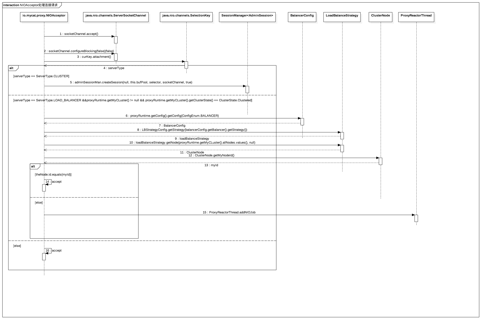
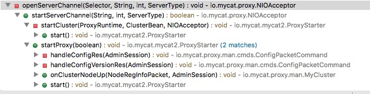
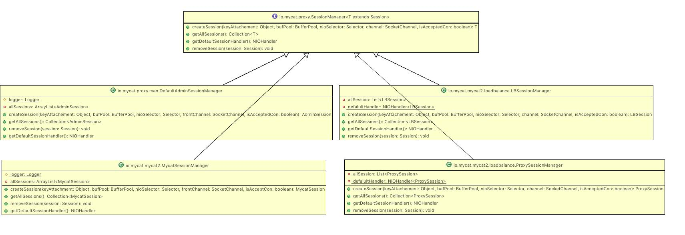
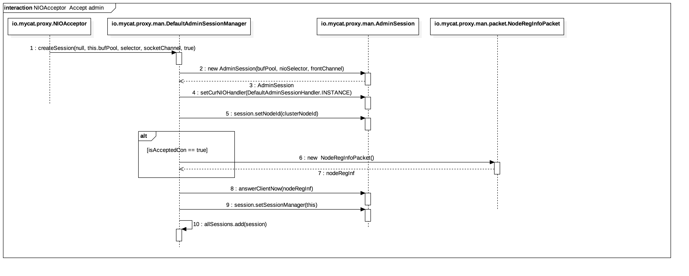
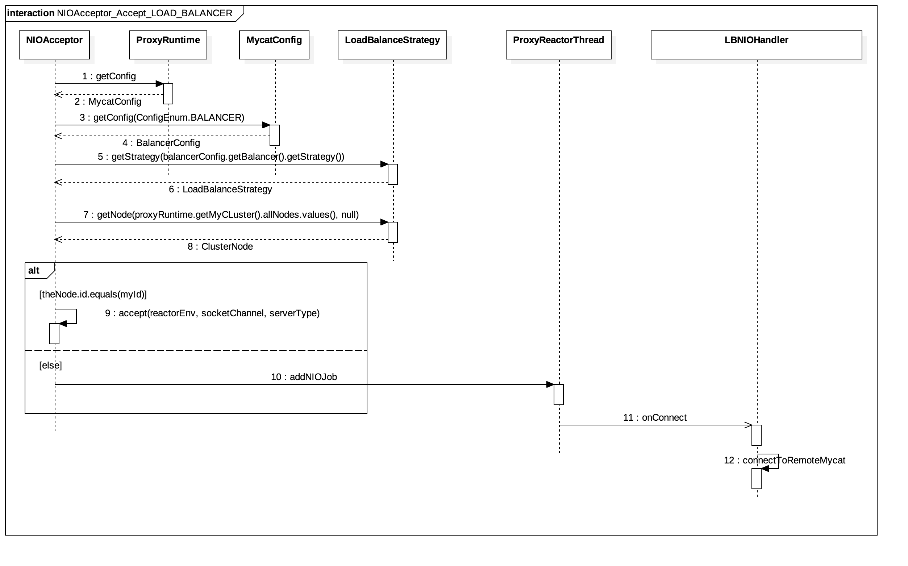
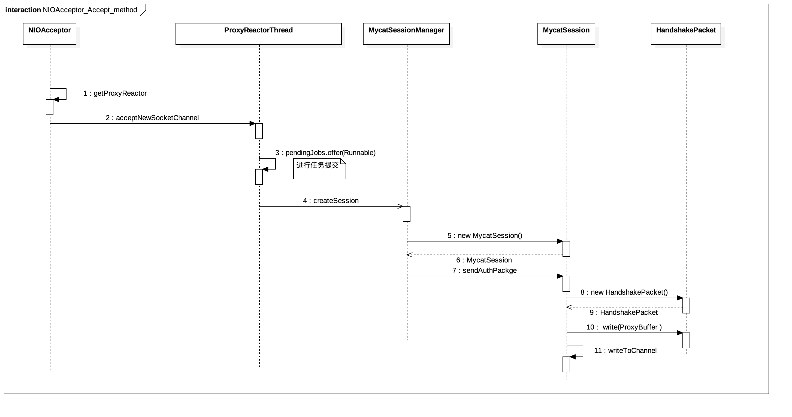

# 前言
之前的两篇文章我们分析了mycat的启动和HeartBeat机制,在HeartBeat的文末我们发现会执行如下代码向mysql发送报文进行心跳检测,代码如下:

```
public void doHeartbeat(){
    optSession.proxyBuffer.reset();
    CommandPacket packet = new CommandPacket();
    packet.packetId = 0;
    packet.command = MySQLPacket.COM_QUERY;

    packet.arg = repBean.getReplicaBean().getRepType().getHearbeatSQL().getBytes();

    packet.write(optSession.proxyBuffer);
    optSession.proxyBuffer.flip();
    optSession.proxyBuffer.readIndex = optSession.proxyBuffer.writeIndex;
    try {
        optSession.writeToChannel();
    } catch (IOException e) {
        e.printStackTrace();
        logger.error(" The backend heartbeat task write to mysql is error . {}",e.getMessage());
        detector.getHeartbeat().setDbSynStatus(DBHeartbeat.DB_SYN_ERROR);
        detector.getHeartbeat().setResult(DBHeartbeat.ERROR_STATUS, detector,  null);
    }
}
```

看到这里,会有很多疑问,比如是怎么与mysql进行通信的, CommandPacket又是什么东东,这些都暂且不表,我们先来看看Mycat是如何处理前端连接与认证的.


#分析

1. 在mycat2.0启动流程中我们可以知道,在io.mycat.mycat2.ProxyStarter#start中我们启动了NIOAcceptor,并调用了其start.代码如下:

	```
	NIOAcceptor acceptor = new NIOAcceptor(new BufferPool(GlobalBean.BUFFER_POOL_SIZE));
		acceptor.start();
	```


2. 由于NIOAcceptor是一个线程,因此为执行如下代码:

	```
	public void run() {
	long ioTimes = 0;
	ReactorEnv reactorEnv = new ReactorEnv();
	while (true) {
		try {
			selector.select(SELECTOR_TIMEOUT);
			final Set<SelectionKey> keys = selector.selectedKeys();
			// logger.info("handler keys ,total " + selected);
			if (keys.isEmpty()) {
				if (!pendingJobs.isEmpty()) {
					ioTimes = 0;
					this.processNIOJob();
				}
				continue;
			} else if ((ioTimes > 5) & !pendingJobs.isEmpty()) {
				ioTimes = 0;
				this.processNIOJob();
			}
			ioTimes++;
			for (final SelectionKey key : keys) {
				try {
					int readdyOps = key.readyOps();
					reactorEnv.curSession = null;
					// 如果当前收到连接请求
					if ((readdyOps & SelectionKey.OP_ACCEPT) != 0) {
						processAcceptKey(reactorEnv, key);
					}
					// 如果当前连接事件
					else if ((readdyOps & SelectionKey.OP_CONNECT) != 0) {
						this.processConnectKey(reactorEnv, key);
					} else if ((readdyOps & SelectionKey.OP_READ) != 0) {
						this.processReadKey(reactorEnv, key);
	
					} else if ((readdyOps & SelectionKey.OP_WRITE) != 0) {
						this.processWriteKey(reactorEnv, key);
					}
				} catch (Exception e) {
					logger.warn("Socket IO err :", e);
					key.cancel();
					if (reactorEnv.curSession != null) {
						reactorEnv.curSession.close(false, "Socket IO err:" + e);
						this.allSessions.remove(reactorEnv.curSession);
						reactorEnv.curSession = null;
					}
				}
			}
			keys.clear();
		} catch (IOException e) {
			logger.warn("caugh error ", e);
		}
	
	}
	
	}
	```

	别看代码长,其实处理逻辑很简单:
		
	1. 通过一个死循环不断的监听事件,获取事件的超时时间为100ms.
	2. 如果没有事件要处理,并且pendingJobs不为空则进行任务处理.
	3. 如果ioTimes大于5并且pendingJobs不为空则进行任务处理.
	4. 否则就对事件进行处理.
	
	> 关于第二点和第三点在 mycat2.0分析系列之二--HeartbeatScheduler分析 中有详细的说明


3. 对于不同的事件处理,调用不同的方法处理,我们依次来梳理一下.
	
	1. 对于连接请求序列图如下:

	
	
	1.1 首先通过SelectionKey获得ServerSocketChannel,然后接收通道，设置为非阻塞模式.
	1.2 然后通过SelectionKey获得ServerType,代码如下:
	
	```
		ServerType serverType = (ServerType) curKey.attachment();
	```
	
	那么问题来了,这个ServerType是什么时候放入的呢？
	
	答案: 是在mycat启动NIOAcceptor时在NIOAcceptor#openServerChannel时将ServerType设置进去的,代码如下:
	
	```
		serverChannel.register(selector, SelectionKey.OP_ACCEPT, serverType);
	```
	
	方法调用链如图所示:
	
	
	
	然后通过serverType进行判断,做相应的处理.

	1.3 如果是CLUSTER类型的话,就调用SessionManager#createSession.这是一个接口,继承结构如图所示:
	
	

	对于当前情况来说,使用的是DefaultAdminSessionManager,原因是其变量是在如下代码中进行赋值的:
	
	```
	if (serverType == ServerType.CLUSTER) {
		adminSessionMan = new DefaultAdminSessionManager();
		ProxyRuntime.INSTANCE.setAdminSessionManager(adminSessionMan);
		logger.info("opend cluster conmunite port on {}:{}", ip, port);
	}
	```
	
	1.4 在DefaultAdminSessionManager#createSession中处理逻辑如下:
		
	1.  创建AdminSession,将CurNIOHandler设为DefaultAdminSessionHandler.
	2. 	如果isAcceptedCon == true,则创建NodeRegInfoPacket,并调用其answerClientNow方法.
	3. 	将AdminSession 的SessionManager设为自己.
	4. 	将该AdminSession加入allSessions(ArrayList 结构)中


	时序图如下:
	
	
	
 	代码如下:
 	
	```
		public AdminSession createSession(Object keyAttachement ,BufferPool bufPool, Selector nioSelector, SocketChannel frontChannel,
		boolean isAcceptedCon) throws IOException {
	
	AdminSession session = new AdminSession(bufPool, nioSelector, frontChannel);
	session.setCurNIOHandler(DefaultAdminSessionHandler.INSTANCE);
	String clusterNodeId = (String) keyAttachement;
	session.setNodeId(clusterNodeId);
	// session.setCurProxyHandler(proxyHandler);
	if (isAcceptedCon) {// 客户端连接上来，所以发送信息给客户端
		NodeRegInfoPacket nodeRegInf = new NodeRegInfoPacket(session.cluster().getMyNodeId(),
				session.cluster().getClusterState(), session.cluster().getLastClusterStateTime(),
				session.cluster().getMyLeaderId(), ProxyRuntime.INSTANCE.getStartTime());
		session.answerClientNow(nodeRegInf);
	}
	logger.info(" connected to cluster port  ." + frontChannel + "create session " + session);
	session.setSessionManager(this);
	allSessions.add(session);
	return session;
	}
 	```
 	
 	1.4.2.1  io.mycat.proxy.man.AdminSession#answerClientNow,代码实现如下:
 	
 	```
public void answerClientNow(ManagePacket packet) throws IOException {
	writingBuffer.getBuffer().limit(writingBuffer.getBuffer().capacity());
	packet.writeTo(writingBuffer);
	this.writeChannel();
}
 	```
 	
 	**注意: 该buffer pool size 默认大小为 1024 * 10**
 	
 	1.4.2.2 io.mycat.proxy.man.AdminSession#writeChannel方法,实现逻辑很简单:
 		
 	1. 首先判断ProxyBuffer 的 readIndex是否大于buffer的容量的2/3.如果大于则调用ProxyBuffer#compact方法进行压缩,否则进行标志位重置.
 	
 	2.   向当前的SocketChannel中写入数据.
 	
 	3.	 调用modifySelectKey方法进行方法的注册.
 	
 	代码如下:
 	
 	```
 	public void writeChannel() throws IOException {
		// 尝试压缩，移除之前写过的内容
		ByteBuffer buffer = writingBuffer.getBuffer();
		if (writingBuffer.readIndex > buffer.capacity() * 2 / 3) {
			writingBuffer.compact();
		}else{
			buffer.limit(writingBuffer.readIndex);
			buffer.position(writingBuffer.readMark);
		}
		int writed = 0;
		try {
			writed = this.channel.write(buffer);
		} catch(IOException e){
			closeSocket(false,"Read EOF ,socket closed ");
		}
		if (writed > 0) {
			writingBuffer.readMark += writed;
		}
		modifySelectKey();
	}
 	``` 
 	
 	1.4.2.3 modifySelectKey的方法中逻辑如下:
 		
 	 1. 首先检查channelKey是否正确.如果判断为false,不进行任何操作,否则执行第二步.

 	 2. 如果writingBuffer.readMark == writingBuffer.readIndex的话,则注册读事件.

 	 3. 否则注册写事件.

	>  	 note: 
	>   nio中的事件类型如下:
	
	> ```	
	> 	public static final int OP_READ = 1 << 0;  // 1  
	> 	public static final int OP_WRITE = 1 << 2  // 4  
	> 	public static final int OP_CONNECT = 1 << 3; // 8  
	> 	public static final int OP_ACCEPT = 1 << 4;  // 16
	> ```
	>  对应于当前代码中,
 	>  
 	* SelectionKey.OP_READ&= ~SelectionKey.OP_WRITE 也	>  就等于 1 &= (~4) 也就是等于1,即读事件
 	> * SelectionKey.OP_READ |= SelectionKey.OP_WRITE 也就是等于 1 |= 4 ,也就是等于5,即读写事件.
 	
	
 2.1 如果当前类型为LOAD_BALANCER并且集群状态为ClusterState.Clustered时,则进行如下处理:
 	
 	1. 获得BalancerConfig事件,并取得相应的负载均衡策略,默认为RANDOM,可在balancer.yml。
 	2. 通过负载均衡策略,选择一个节点,如果选择下的节点是当前节点,则调用accept方法,否则就有远程节点通信.进行链接的建立.

 	时序图如下:
 	
 	
 	
 	代码如下:
 	
 	```
	ProxyReactorThread<?> proxyReactor = getProxyReactor(reactorEnv);
			proxyReactor.addNIOJob(() -> {
				try {
					LBSession lbSession = ProxyRuntime.INSTANCE.getLbSessionSessionManager()
															   .createSession(null, proxyReactor.bufPool,
																			  proxyReactor.getSelector(),
																			  socketChannel, false);
					lbSession.getCurNIOHandler().onConnect(curKey, lbSession, true, null);
				} catch (IOException e) {
					logger.warn("load balancer accepted error:", e);
				}
			});
 	```
 	
 	2.2.1 调用io.mycat.mycat2.loadbalance.LBNIOHandler#onConnect方法,该方法直接调用了内部的connectToRemoteMycat方法,代码如下:
 	
 	```
	@Override
public void onConnect(SelectionKey curKey, LBSession session, boolean success, String msg) throws IOException {
    ProxyRuntime runtime = ProxyRuntime.INSTANCE;
    MyCluster cluster = runtime.getMyCLuster();
    BalancerConfig balancerConfig = runtime.getConfig().getConfig(ConfigEnum.BALANCER);
    LoadBalanceStrategy loadBalanceStrategy =
            LBStrategyConfig.getStrategy(balancerConfig.getBalancer().getStrategy());
    ClusterNode clusterNode = loadBalanceStrategy.getNode(cluster.allNodes.values(), null);
    connectToRemoteMycat(clusterNode.ip, clusterNode.proxyPort, runtime.getAcceptor().getSelector(), session);
}
 	```
 	2.2.2 而在connectToRemoteMycat方法中,则更是简单,目前我们知道了远程的ip和端口,那么直接链接便是,于是 代码如下:
 	
 	```
   private void connectToRemoteMycat(String ip, int port, Selector selector, LBSession lbSession) throws IOException {
	logger.info("load balancer dispatch connection to {}:{}", ip, port);
	InetSocketAddress address = new InetSocketAddress(ip, port);
	SocketChannel sc = SocketChannel.open();
	sc.configureBlocking(false);
	sc.register(selector, SelectionKey.OP_CONNECT, lbSession);
	sc.connect(address);
}
 	```
 	
 	接下来如何处理呢,且处理逻辑便是在io.mycat.proxy.NIOAcceptor#accept
 	
	3.1 在io.mycat.proxy.NIOAcceptor#accept首先找到一个可用的NIO Reactor Thread，交付托管,然后将通道注册到reactor对象上.代码如下:
	
	```
	private void accept(ReactorEnv reactorEnv,SocketChannel socketChannel,ServerType serverType) throws IOException {
	// 找到一个可用的NIO Reactor Thread，交付托管
	ProxyReactorThread<?> nioReactor = getProxyReactor(reactorEnv);
	// 将通道注册到reactor对象上
	nioReactor.acceptNewSocketChannel(serverType, socketChannel);
}
	```
	
	3.2 在io.mycat.proxy.ProxyReactorThread#acceptNewSocketChannel中提交了一个任务,由之前可知,该任务会最终被本类内部的一个后台线程所调用,代码如下:
	
	```
	public void acceptNewSocketChannel(Object keyAttachement, final SocketChannel socketChannel) throws IOException {
	pendingJobs.offer(() -> {
		try {
			T session = sessionMan.createSession(keyAttachement, this.bufPool, selector, socketChannel, true);
			allSessions.add(session);
		} catch (Exception e) {
			logger.warn("regist new connection err " + e);
		}
	});
}
	```
	**注意: 这里的sessionMan指的是MycatSessionManager,在启动时配置的**,如下所示:
	
	```
	runtime.setSessionManager(new MycatSessionManager());
	```
	
	3.3 在io.mycat.mycat2.MycatSessionManager#createSession方法中,做了:
	
	1. 	首先创建了MycatSession,并将第一个IO处理器设为Client Authorware
	1. 	向MySQL Client发送认证报文
	1. 	设置SessionManager为MycatSessionManager
	1. 	添加到内部的allSessions(ArrayList)中
	
	时序图如下:
	
	
	
	代码如下:
	
	```
	public MycatSession createSession(Object keyAttachment, BufferPool bufPool, Selector nioSelector,
		SocketChannel frontChannel, boolean isAcceptCon) throws IOException {
	logger.info("MySQL client connected  ." + frontChannel);
	MycatSession session = new MycatSession(bufPool, nioSelector, frontChannel);
	// 第一个IO处理器为Client Authorware
	session.setCurNIOHandler(MySQLClientAuthHandler.INSTANCE);
	// 默认为透传命令模式
	//session.curSQLCommand = DirectPassthrouhCmd.INSTANCE;
	// 向MySQL Client发送认证报文
	session.sendAuthPackge();
	session.setSessionManager(this);
	allSessions.add(session);
	return session;
}
	```
	
	接下来就是mysql 前端链接建立的认证机制了,我们下篇接着分析.