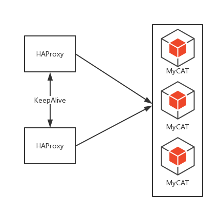
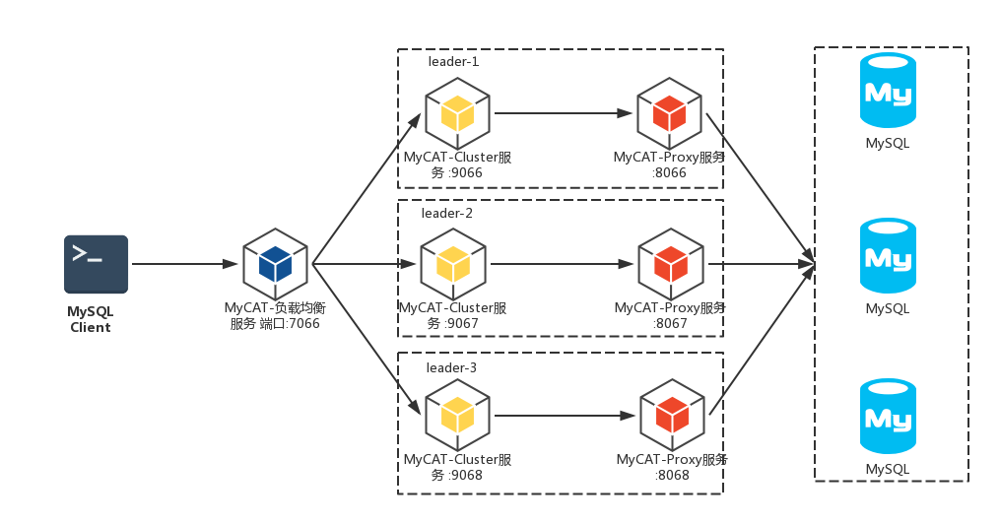
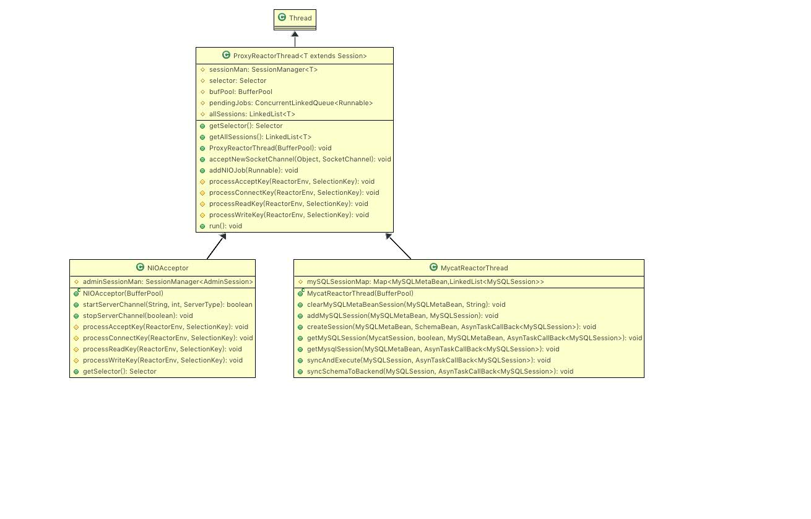
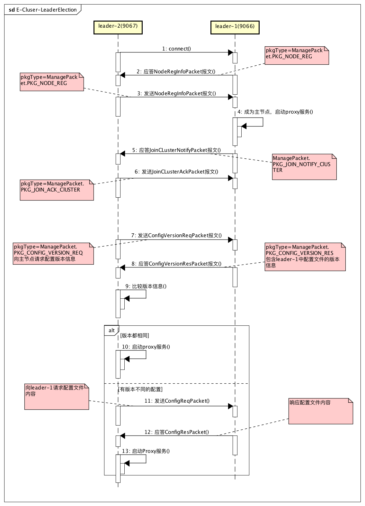

# MyCAT2新特性之自动集群

> 注：本文基于MyCAT2 alpha版发布稍后的一个版本进行分析，commitid: d8294ffcda2dd17a6a66f3123dfb962f0efa8abe

## 1.功能说明
1.x版本的MyCAT高可用（集群和负载均衡）是依靠第三方负载均衡器如HAProxy来实现的，如下图


从MyCAT2.0开始，集群和负载均衡就成为MyCAT自身提供的特性。不需要再依赖外部的负载均衡组件，运维部署更加简单。
### 逻辑架构


负载均衡服务根据某种可配置的算法（如random，roundrobin等）将请求报文路由到某个cluster节点，cluster节点再把报文透传到对应的proxy服务，例如leader-1中的9066端口的cluster服务透传到8066端口的proxy服务，然后proxy服务再到后端mysql去执行命令。

上图的MyCAT集群中有3组节点，分别是leader-1，leader-2，leader-3；以leader-1为例，这里虽然有2个服务，但实际上它们属于同一个进程，只不过开了两个端口。7066端口的负载均衡服务负责与mysql客户端交互，它实际上也是跟cluster和proxy服务属于同一个进程的（例如同属于leader-1）。

### 配置
* balancer.yml

```
balancer:
  enable: true
  ip: 0.0.0.0
  port: 7066
  strategy: RANDOM
```

* cluser.yml

```
cluster:
  enable: true
  ip: 0.0.0.0
  port: 9066
  myNodeId: leader-1
  allNodes: leader-1:127.0.0.1:9066,leader-2:127.0.0.1:9067,leader-3:127.0.0.1:9068
  prepareDelaySeconds: 30
```

* mycat.yml (对应proxy服务)

```
proxy:
  ip: 0.0.0.0
  port: 8066
```

> 以上cluser.yml和mycat.yml 的配置是属于leader-1的，leader-2和leader-3区分开端口另行配置即可。

* 连接后端mysql的配置

在datasource.yml 和 schema.yml 中声明。也是必须的，但本文暂不涉及。

* user.yml

配置登录信息

```
users:
  - name: root
    password: 123456
    schemas:
      - myfly
```


### 运行

1. linux 环境 运行 bin 目录下 ./mycat {console | start | stop | restart | status | dump }
2.  window 环境 运行 bin 目录下 startup_nowrap.bat
3. 本地调试可运行 io.mycat.mycat2.MyCatCore

分别启动3个进程，leader-1,2,3。

## 2.源码分析

###2.1 启动MyCAT
运行MycatCore的main函数。程序首先会加载配置（包括配置文件和运行参数），并创建一个MycatReactorThread线程数组，元素个数为CPU核数，再初始化MyCAT的运行环境，接着启动MyCAT。

```
public static void main(String[] args) throws IOException {
	ProxyRuntime runtime = ProxyRuntime.INSTANCE;
	runtime.setConfig(new MycatConfig());
	
	ConfigLoader.INSTANCE.loadCore();
	solveArgs(args);
	
	int cpus = Runtime.getRuntime().availableProcessors();
	runtime.setNioReactorThreads(cpus);
	runtime.setReactorThreads(new MycatReactorThread[cpus]);
	
	runtime.setSessionManager(new MycatSessionManager());
	runtime.init();
	
	ProxyStarter.INSTANCE.start();
}
```
#### 开启NIOAcceptor线程
ProxyStarter的start方法负责启动MyCAT，第一步是先开启一个NIOAcceptor线程，然后判断是否开启集群，开启则调用startCluster方法，否则调用startProxy方法。代码如下。

```
public void start() throws IOException {
		ProxyRuntime runtime = ProxyRuntime.INSTANCE;
		MycatConfig conf = runtime.getConfig();

		// 启动NIO Acceptor
		NIOAcceptor acceptor = new NIOAcceptor(new BufferPool(GlobalBean.BUFFER_POOL_SIZE));
		acceptor.start();
		runtime.setAcceptor(acceptor);

		ClusterConfig clusterConfig = conf.getConfig(ConfigEnum.CLUSTER);
		ClusterBean clusterBean = clusterConfig.getCluster();
		if (clusterBean.isEnable()) {
			// 启动集群
			startCluster(runtime, clusterBean, acceptor);
		} else {
			// 未配置集群，直接启动
			startProxy(true);
		}
	}
```

在这里先简单的知道下startCluster方法最终会同时启动cluser服务和proxy服务，而startProxy方法只启动proxy服务。

NIOAcceptor和前面的MycatReactorThread都继承自ProxyReactorThread类，都属于Reactor线程。只是职责不同，NIOAcceptor线程用于监听服务，接收客户端的TCP请求；MycatReactorThread负责网络I/O操作，比如与后端mysql的数据包的读写交互。

#### 开启集群

##### 监听
startCluster方法主要做两件事，一是开启集群服务监听（如监听9066端口），二是初始化集群。代码如下。

```
private void startCluster(ProxyRuntime runtime, ClusterBean clusterBean, NIOAcceptor acceptor) throws IOException {
		// 集群模式下，需要等集群启动，主节点确认完配置才能提供服务
		acceptor.startServerChannel(clusterBean.getIp(), clusterBean.getPort(), ServerType.CLUSTER);

		MyCluster cluster = new MyCluster(acceptor.getSelector(), clusterBean.getMyNodeId(), ClusterNode.parseNodesInf(clusterBean.getAllNodes()));
		runtime.setAdminCmdResolver(new AdminCommandResovler());
		runtime.setMyCLuster(cluster);
		cluster.initCluster();
}	
```

NIOAcceptor的startServerChannel方法就是用来开启监听的，该方法内首先根据ServerType获取acceptor中的serverSocketChannel实例，如果实例存在且处于open状态，说明该端口在此前已经被打开监听。否则通过openServerChannel方法开启监听。代码如下。

```
public boolean startServerChannel(String ip, int port, ServerType serverType) throws IOException {
		final ServerSocketChannel serverChannel = getServerSocketChannel(serverType);
		if (serverChannel != null && serverChannel.isOpen()) {
			return false;
		}
		...
		openServerChannel(selector, ip, port, serverType);
		return true;
}
```

开启监听的过程如下：先打开一个ServerSocketChannel，绑定ip和port,把serverChannel设置为非阻塞模式，并把channel注册到NIOAcceptor的selector上，关注Accept事件，把serverType即ServerType.Cluser 附加（attach）到该channel上。代码如下。

```
private void openServerChannel(Selector selector, String bindIp, int bindPort, ServerType serverType)
			throws IOException {
		final ServerSocketChannel serverChannel = ServerSocketChannel.open();
		final InetSocketAddress isa = new InetSocketAddress(bindIp, bindPort);
		serverChannel.bind(isa);
		serverChannel.configureBlocking(false);
		serverChannel.setOption(StandardSocketOptions.SO_REUSEADDR, true);
		serverChannel.register(selector, SelectionKey.OP_ACCEPT, serverType);
		...
	}
```

##### 初始化集群
startCluster方法的第二件事就是初始化集群，其实就是当前节点去连接集群中的其他节点。代码如下。

```
public void initCluster() {
		ClusterNode[] nodes = new ClusterNode[allNodes.size()];
		allNodes.values().toArray(nodes);
		// 排序结果，节点最大的在数组第一个位置
		Arrays.sort(nodes);
		for (ClusterNode curNode : nodes) {
			if (curNode.equals(myNode))
				continue;
			try {
				logger.info("Connecting to MycatNode " + curNode);
				InetSocketAddress serverAddress = new InetSocketAddress(curNode.ip, curNode.port);
				SocketChannel socketChannel = SocketChannel.open();
				socketChannel.configureBlocking(false);
				socketChannel.register(nioSelector, SelectionKey.OP_CONNECT, curNode.id);
				socketChannel.connect(serverAddress);
			} catch (Exception e) {
				logger.warn("connect err " + e);
			}
		}
	}
```
值得注意的是这句
> socketChannel.register(nioSelector, SelectionKey.OP_CONNECT, curNode.id); 

socketChannel被注册到NIOAcceptor的多路复用器上，关注的事件是CONNECT事件，attach到channel上的是对端节点的ID即curNode.id。

连接建立后通过和其他节点产生一系列的信息交互，当前节点会加入到集群中。这会在后面分析。

### 2.2 集群主节点选举
一个节点加入集群后的第一件事就是去询问谁是主节点，如果还没有主节点就参与选举主节点。本节重点分析主节点选举过程。

#### NIOAcceptor
从“启动MyCAT”一节的分析我们知道,有一个NIOAcceptor线程被开启了.NIOAcceptor继承自ProxyReactoryThread。

##### NIOAcceptor的类继承关系图

这里重点看它们共同的run()方法。在无限循坏while(true)内，轮询多路复用器selector。如果注册到该selector上的channel暂时没有NIO事件发生，且pendingjobs中有NIO任务，则处理这些任务，随后进入下一次轮询。如果有NIO事件发生，但此前已连续处理过5次NIO事件，且pendingJobs中有NIO任务，则先处理任务再处理NIO事件。代码如下。

```
public void run() {
		long ioTimes = 0;
		ReactorEnv reactorEnv = new ReactorEnv();
		while (true) {
			try {
				selector.select(SELECTOR_TIMEOUT);
				final Set<SelectionKey> keys = selector.selectedKeys();
				// logger.info("handler keys ,total " + selected);
				if (keys.isEmpty()) {
					if (!pendingJobs.isEmpty()) {
						ioTimes = 0;
						this.processNIOJob();
					}
					continue;
				} else if ((ioTimes > 5) & !pendingJobs.isEmpty()) {
					ioTimes = 0;
					this.processNIOJob();
				}
				ioTimes++;
				for (final SelectionKey key : keys) {
					try {
						int readdyOps = key.readyOps();
						reactorEnv.curSession = null;
						// 如果当前收到连接请求
						if ((readdyOps & SelectionKey.OP_ACCEPT) != 0) {
							processAcceptKey(reactorEnv, key);
						}
						// 如果当前连接事件
						else if ((readdyOps & SelectionKey.OP_CONNECT) != 0) {
							this.processConnectKey(reactorEnv, key);
						} else if ((readdyOps & SelectionKey.OP_READ) != 0) {
							this.processReadKey(reactorEnv, key);

						} else if ((readdyOps & SelectionKey.OP_WRITE) != 0) {
							this.processWriteKey(reactorEnv, key);
						}
					} catch (Exception e) {
						logger.warn("Socket IO err :", e);
						key.cancel();
						if (reactorEnv.curSession != null) {
							reactorEnv.curSession.close(false, "Socket IO err:" + e);
							this.allSessions.remove(reactorEnv.curSession);
							reactorEnv.curSession = null;
						}
					}
				}
				keys.clear();
			} catch (IOException e) {
				logger.warn("caugh error ", e);
			}

		}

	}
}

```

对于网络IO事件，根据不同的事件类型（accept，connect，read，write）用对应的processXXXKey方法处理。这些process方法，NIOAcceptor都有自己的实现。下面为方便讨论和理解，用leader-1和leader-2两个节点为例，讲解选举主节点的过程。

#### 节点间建立连接
先启动leader-1(监听端口9066)，由于当前只有它一个节点，集群选举未开始，它启动了之后，就在那等着其他节点过来连接。再启动leader-2（端口9067），leader-2会去连接leader-1。TCP连接建立后，leader-1会收到accept事件，leader-2收到connect事件。先来看leader-1是如何处理accept事件的。

##### NIOAcceptor#processAcceptKey

```
protected void processAcceptKey(ReactorEnv reactorEnv, SelectionKey curKey) throws IOException {
		ServerSocketChannel serverSocket = (ServerSocketChannel) curKey.channel();
		// 接收通道，设置为非阻塞模式
		final SocketChannel socketChannel = serverSocket.accept();
		socketChannel.configureBlocking(false);
		logger.info("new Client connected: " + socketChannel);
		ServerType serverType = (ServerType) curKey.attachment();
		ProxyRuntime proxyRuntime = ProxyRuntime.INSTANCE;
		// 获取附着的标识，即得到当前是否为集群通信端口
		if (serverType == ServerType.CLUSTER) {
			adminSessionMan.createSession(null, this.bufPool, selector, socketChannel, true);
		} else if (serverType == ServerType.LOAD_BALANCER &&
				   proxyRuntime.getMyCLuster() != null &&
                   proxyRuntime.getMyCLuster().getClusterState() == ClusterState.Clustered) {
			...
		} else {
			...
		}
	}
```
首先通过selectionKey获取关联的channel，在这里是ServerSocketChannel。再通过serverSocketChannel.accept()获取SocketChannel，SocketChannel在这里代表的是leader-2到leader-1的TCP连接通道。通过selectionKey.attachment()获取当前的ServerType，为什么这个attachment是个ServerType。请回想一下在启动监听时，ServerCocketChannel是这样注册到selector的：

> serverChannel.register(selector, SelectionKey.OP_ACCEPT, serverType);

接着分析，由于当前的ServerType是CLUSTER,所以程序会来到这个分支：

```
adminSessionMan.createSession(null, this.bufPool, selector, socketChannel, true);
```
来看下DefaultAdminSessionManager的createSesssion方法：

```
public AdminSession createSession(Object keyAttachement ,BufferPool bufPool, Selector nioSelector, SocketChannel frontChannel,
			boolean isAcceptedCon) throws IOException {

		AdminSession session = new AdminSession(bufPool, nioSelector, frontChannel);
		session.setCurNIOHandler(DefaultAdminSessionHandler.INSTANCE);
		String clusterNodeId = (String) keyAttachement;
		session.setNodeId(clusterNodeId);
		// session.setCurProxyHandler(proxyHandler);
		if (isAcceptedCon) {// 客户端连接上来，所以发送信息给客户端
			NodeRegInfoPacket nodeRegInf = new NodeRegInfoPacket(session.cluster().getMyNodeId(),
					session.cluster().getClusterState(), session.cluster().getLastClusterStateTime(),
					session.cluster().getMyLeaderId(), ProxyRuntime.INSTANCE.getStartTime());
			session.answerClientNow(nodeRegInf);
		}
		logger.info(" connected to cluster port  ." + frontChannel + "create session " + session);
		session.setSessionManager(this);
		allSessions.add(session);
		return session;
	}
```
主要做了几件事：

* 创建AdminSession实例
* 设置adminSession的当前NIOHandler为DefaultAdminSessionHandler
* isAcceptedCon参数为true，因此构建NodeRegInfoPacket报文，并发送给对端，也就是leader-1发送给leader-2。

AdminSession是一个集群管理会话的抽象，它意味着一个连接通道，通过它可以在这个通道上进行读写操作。看下它的构造函数便知：

```
public AdminSession(BufferPool bufferPool, Selector selector, SocketChannel channel) throws IOException {
		this.bufPool = bufferPool;
		this.nioSelector = selector;
		this.channel = channel;
		InetSocketAddress clientAddr = (InetSocketAddress) channel.getRemoteAddress();
		this.addr = clientAddr.getHostString() + ":" + clientAddr.getPort();
		SelectionKey socketKey = channel.register(nioSelector, SelectionKey.OP_READ, this);
		this.channelKey = socketKey;
		this.sessionId = ProxyRuntime.INSTANCE.genSessionId();
		this.readingBuffer = new ProxyBuffer(bufferPool.allocByteBuffer());
		this.writingBuffer = new ProxyBuffer(bufferPool.allocByteBuffer());

	}
```
它持有SocketChannel的引用，即该session能操作这个SocketChannel上的数据。并请留意这一句：
> SelectionKey socketKey = channel.register(nioSelector, SelectionKey.OP_READ, this);

将该socketChannel注册到selector上，并关注Read事件，attachment是当前adminSession对象。
这一句代表的含义是：现在连接建立了，那么我leader-1的selector需要关注这条通道上的读事件了。
也就是leader-1在等着读取leader-2的报文了。那么如果leader-2的报文来了，AdminSession该怎么处理呢？交给DefaultAdminSessionHandler处理：
> session.setCurNIOHandler(DefaultAdminSessionHandler.INSTANCE);

然后leader-1给leader-2应答NodeRegInfoPacket报文。该报文用于向对方表明自己的身份信息（nodeId）以及自己所处的集群状态。下面是NodeRegInfoPacket的构造函数：

```
public NodeRegInfoPacket(String nodeId, MyCluster.ClusterState myClusterState,long lastClusterStateTime,String myLeader,long startupTime) {
		super(ManagePacket.PKG_NODE_REG);
		this.nodeId = nodeId;
		this.clusterState=myClusterState;
		this.lastClusterStateTime=lastClusterStateTime;
		setMyLeader(myLeader);
		this.startupTime = startupTime;
		ProxyConfig proxyConfig = ProxyRuntime.INSTANCE.getConfig().getConfig(ConfigEnum.PROXY);
		this.proxyPort = proxyConfig.getProxy().getPort();
	}
```

首先声明数据包类型是`PKG_NODE_REG`；设置nodeId，也就是leader-1；当前所处的集群状态cluserState，此时是ClusterState.Joining；proxy服务端口等等。

##### NIOAcceptor#processConnectKey

再来看看leader-2这边对Connect事件的处理。代码如下。

```
protected void processConnectKey(ReactorEnv reactorEnv, SelectionKey curKey) throws IOException {
		// only from cluster server socket
		SocketChannel curChannel = (SocketChannel) curKey.channel();
		Object obj = curKey.attachment();
		try {
			if (curChannel.finishConnect()) {
				if (obj != null && obj instanceof LBSession) {
					...
				} else {
					AdminSession session = adminSessionMan.createSession(curKey.attachment(), this.bufPool, selector,
																		 curChannel, false);
					NIOHandler<AdminSession> connectIOHandler = (NIOHandler<AdminSession>) session
							.getCurNIOHandler();
					connectIOHandler.onConnect(curKey, session, true, null);
				}
			}

		} catch (ConnectException ex) {
			...
		}
	}

```

首先获取channel上的attachment。在“初始化集群”一节中有讲过，leader-2把socketChannel注册到多路复用器时，attach到channel上的是对端节点的ID即curNode.id。
> socketChannel.register(nioSelector, SelectionKey.OP_CONNECT, curNode.id); 

该ID是个String类型，所以*if (obj != null && obj instanceof LBSession)*语句判断为false，程序会走else分支。同样是创建一个AdminSession，但跟对端leader-1不同，作为创建连接的发起方，leader-2调用createSession时isAcceptedCon参数为false。所以leader-2在这里不需要应答leader-1。

接着调用DefaultAdminSessionHandler的onConnect方法，目前只是打印一些信息，没有实际处理逻辑。

#### Leader选举
连接建立后，leader-1向leader-2应答了一个NodeRegInfoPacket报文，且看下leader-2接收后是如何处理的？

##### NIOAcceptor#processReadKey

```
protected void processReadKey(ReactorEnv reactorEnv, SelectionKey curKey) throws IOException {
		// only from cluster server socket
		Session session = (Session) curKey.attachment();
		session.getCurNIOHandler().onSocketRead(session);
}
```
由前面分析可知selectionKey的attachment是一个AdminSession。该session当前的NIOHandler是DefaultAdminSessionHandler，它的onSocketRead方法代码如下。

```
public void onSocketRead(final AdminSession session) throws IOException {
		boolean readed = session.readSocket();

		// 没有读到完整报文
		if (readed == false) {
			return;
		}
//		int bufferLimit = session.readingBuffer.writeIndex;
		byte pkgType = -1;
		while ((pkgType = session.receivedPacket()) != -1) {
//			session.readingBuffer.writeIndex = session.curAdminPkgInf.startPos;
			if (pkgType == ManagePacket.PKG_FAILED || pkgType == ManagePacket.PKG_SUCCESS) {
				session.curAdminCommand.handlerPkg(session, pkgType);
			} else {
				session.curAdminCommand = ProxyRuntime.INSTANCE.getAdminCmdResolver().resolveCommand(pkgType);
				session.curAdminCommand.handlerPkg(session, pkgType);
			}
			// 下一个报文解析
			session.readingBuffer.readIndex = session.curAdminPkgInf.startPos+session.curAdminPkgInf.length;
		}

//		session.readingBuffer.writeIndex = bufferLimit;
	}

```

> *注：由于对报文的解析涉及到ProxyBuffer的操作和类似MySQL二进制协议报文的解析，这是比较花费篇幅来解释的。本文重点在集群本身，即使暂时不深究报文解析，也不影响对集群的理解，所以本文暂不涉及报文解析的过程。*

首先session通过对报文的解析得到数据包类型pkgType，由前面分析知道leader-1给leader-2应答的数据包类型是`ManagePacket.PKG_NODE_REG`。再看ProxyRuntime.INSTANCE.getAdminCmdResolver().resolveCommand(pkgType)，是根据pkgType获得对应的AdminCommand来处理报文。进入AdminCommandResovler的resolveCommand方法发现，是从一个map里获取对应的AdminCommand。

```
public AdminCommand resolveCommand(byte pkgType) {
		AdminCommand cmd = this.adminCommandMap.get(pkgType);
		return (cmd != null) ? cmd : defaultCmd;
}
```

再看AdminCommandResovler类的initCmdMap，原来`PKG_NODE_REG`类型对应的是NodeRegInfoPacketCommand。

```
protected void initCmdMap()
	{
		adminCommandMap.put(ManagePacket.PKG_NODE_REG, new NodeRegInfoPacketCommand());

		...
	}
```
##### leader-2处理NodeRegInfoPacket报文

继续分析leader-2是如何通过NodeRegInfoPacketCommand处理NodeRegInfoPacket报文的。代码如下。

```
public class NodeRegInfoPacketCommand implements AdminCommand {
	protected static Logger logger = LoggerFactory.getLogger(NodeRegInfoPacketCommand.class);

	@Override
	public void handlerPkg(AdminSession session,byte cmdType) throws IOException {
		NodeRegInfoPacket pkg = new NodeRegInfoPacket();
		pkg.resolve(session.readingBuffer);
		session.setNodeId(pkg.getNodeId());
		session.cluster().onClusterNodeUp(pkg,session);
		if (!pkg.isAnswer()) {// 连接到对端后收到对端发送的注册信息，此时应答自己的注册状态
			pkg = new NodeRegInfoPacket(session.cluster().getMyNodeId(), session.cluster().getClusterState(),
					session.cluster().getLastClusterStateTime(), session.cluster().getMyLeaderId(),
					ProxyRuntime.INSTANCE.getStartTime());
			pkg.setAnswer(true);
			session.answerClientNow(pkg);
		}
	}
}
```
*NodeRegInfoPacket.resolve(session.readingBuffer)* 是把readingBuffer中的二进制数据解析出来填充到NodeRegInfoPacket的各个属性当中。

接着调用 *session.cluster().onClusterNodeUp(pkg,session)* ，leader-2节点尝试加入集群。代码如下。

```
public void onClusterNodeUp(NodeRegInfoPacket pkg, AdminSession session) throws IOException {
		String theNodeId = pkg.getNodeId();
		ClusterNode theNode = allNodes.get(theNodeId);
		theNode.proxyPort = pkg.getProxyPort();
		theNode.setNodeStartTime(pkg.getStartupTime());
		theNode.setState(NodeState.Online);
		theNode.setMyLeaderId(pkg.getMyLeader());
		theNode.setMyClusterState(pkg.getClusterState(), pkg.getLastClusterStateTime());
		logger.info("Node online {} at {}:{} started at {} cluster leader {} cluster state {} cluster time:{} proxy port:{}",
				theNode.id, theNode.ip, theNode.port, new Timestamp(theNode.getNodeStartTime()), theNode.getMyLeaderId(),
				theNode.getMyClusterState(), theNode.getLastClusterStateTime(), theNode.proxyPort);

		if (clusterState == ClusterState.Joining || clusterState == ClusterState.LeaderElection) {
			if (theNode.getMyClusterState() == ClusterState.Clustered) {
				...
			} else if (checkIfLeader()) {
				// 是连接中当前编号最小的节点，当选为Leader
				logger.info("I'm smallest alive node, and exceeded 1/2 nodes alive, so I'm the King now!");
				// 集群主已产生，继续加载配置，提供服务
				ProxyStarter.INSTANCE.startProxy(true);

				this.setClusterState(ClusterState.Clustered);
				this.myNode.setMyLeaderId(getMyNodeId());
				this.myLeader = this.myNode;
				JoinCLusterNotifyPacket joinReps = createJoinNotifyPkg(session,JoinCLusterNotifyPacket.JOIN_STATE_NEED_ACK);
				notifyAllNodes(session,joinReps);
			} else if (theNode.getMyClusterState() == ClusterState.LeaderElection) {
				setClusterState(ClusterState.LeaderElection);
			}
		} else if (myLeader == myNode) {// 当前是集群状态，并且自己是Leader，就回话，可以加入集群
			session.answerClientNow(createJoinNotifyPkg(session,JoinCLusterNotifyPacket.JOIN_STATE_NEED_ACK));
		}
	}

```
首先把NodeRegInfoPacket参数中的信息放到theNode，也就是theNode表示leader-1。此时theNode的CluserState是CluserState.Joining，当前节点leader-2的CluserState也是CluserState.Joining。因此***if(clusterState == ClusterState.Joining)***返回true，***if(theNode.getMyClusterState() == ClusterState.Clustered)*** 返回false，程序会来到这个判断分支***else if(checkIfLeader())***。判断能否成为leader节点的逻辑如下。

```
private boolean checkIfLeader() {
	int halfAllCount = allNodes.size() >> 1;
	int myAliveCount = getMyAliveNodesCount();
	if (nodesIsOdd()) {
		//奇数个节点，判断是否>一半
		return (myAliveCount > halfAllCount && imSmallestAliveNode());
	} else {
		//偶数个节点，判断是否>一半 或者 =一半时主节点是集群中最小的节点
		return (myAliveCount > halfAllCount && imSmallestAliveNode()) || (myAliveCount == halfAllCount && imSmallestInNodes());
	}
}
```
满足以下其中一个条件，就能成为leader节点：

1. 所有节点个数是奇数，活动节点大于1半且当前节点是所有活动节点中最小的节点；
2. 所有节点个数是偶数，活动节点大于1半且当前节点是所有活动节点中最小的节点；
3. 所有节点个数是偶数，活动节点等于1半且当前节点是所有节点中最小的节点；

所谓最小的节点，是指节点Id按字典序排列时最小的节点。
在我们这个场景里，节点个数是2，活动节点个数是2，大于一半，但当前节点leader-2不是最小的节点，所以它不能成为leader节点。

接着leader-2应答leader-1,发送的也是NodeRegInfoPacket报文。这个时候leader-2的CluserState仍然是Joining。

```
if (!pkg.isAnswer()) {// 连接到对端后收到对端发送的注册信息，此时应答自己的注册状态
	pkg = new NodeRegInfoPacket(session.cluster().getMyNodeId(), session.cluster().getClusterState(),
			session.cluster().getLastClusterStateTime(), session.cluster().getMyLeaderId(),
			ProxyRuntime.INSTANCE.getStartTime());
	pkg.setAnswer(true);
	session.answerClientNow(pkg);
}
```

##### leader-1处理NodeRegInfoPacket报文
leader-1同样是用NodeRegInfoPacketCommand来处理NodeRegInfoPacket，区别在于leader-1能成为leader节点，因为“leader-1”字典序比“leader-2”小。

```
...
else if (checkIfLeader()) {
	// 是连接中当前编号最小的节点，当选为Leader
	logger.info("I'm smallest alive node, and exceeded 1/2 nodes alive, so I'm the King now!");
	// 集群主已产生，继续加载配置，提供服务
	ProxyStarter.INSTANCE.startProxy(true);

	this.setClusterState(ClusterState.Clustered);
	this.myNode.setMyLeaderId(getMyNodeId());
	this.myLeader = this.myNode;
	JoinCLusterNotifyPacket joinReps = createJoinNotifyPkg(session,JoinCLusterNotifyPacket.JOIN_STATE_NEED_ACK);
	notifyAllNodes(session,joinReps);
} 
...
```
checkIfLeader()为true，调用 ***ProxyStarter.INSTANCE.startProxy(true)*** ，startProxy方法启动8066端口的proxy服务，该服务负责与后端MySQL建立连接，透传客户端的MySQL命令到后端MySQL等，也就是传统的MyCAT服务。由于startProxy的步骤也比较多，限于篇幅本文不做详细分析（另起文章再述吧）。

启动proxy后，集群状态变为ClusterState.Clustered；接着leader-1向所有与其连接的活动节点应答JoinCLusterNotifyPacket报文。而JoinCLusterNotifyPacket的pkgType是`ManagePacket.PKG_JOIN_NOTIFY_ClUSTER`。

#### 从节点同步配置文件

##### leader-2处理JoinCLusterNotifyPacket报文
leader-2接收到JoinCLusterNotifyPacket报文后用ClusterJoinPacketCommand进行处理。代码如下。

```
public void handlerPkg(AdminSession session, byte cmdType) throws IOException {
		if (cmdType == ManagePacket.PKG_JOIN_REQ_ClUSTER) {
			...
		} else if (cmdType == ManagePacket.PKG_JOIN_ACK_ClUSTER) {
			...
		} else if (cmdType == ManagePacket.PKG_JOIN_NOTIFY_ClUSTER) {
			logger.debug(" handler PKG_JOIN_NOTIFY_ClUSTER package. from {} ",session.getNodeId());
			// leader 批准加入Cluster
			JoinCLusterNotifyPacket respPacket = new JoinCLusterNotifyPacket(null);
			respPacket.resolve(session.readingBuffer);
			if (respPacket.getJoinState() == JoinCLusterNotifyPacket.JOIN_STATE_DENNIED) {
				logger.warn("Leader denied my join cluster request from {} ",session.getNodeId());
			} else if (respPacket.getJoinState() == JoinCLusterNotifyPacket.JOIN_STATE_NEED_ACK) {
				logger.debug(" handler JOIN_STATE_NEED_ACK package. from {} ",session.getNodeId());
				String nodeId = session.getNodeId();
				if (nodeId == null) {
					sendRegInfo(session);
					return;
				}

				if (session.cluster().getClusterState() == ClusterState.Clustered) {
					// 节点已经收到主节点的JOIN_STATE_NEED_ACK报文，直接返回
					logger.debug("node already in clustered state, this package may duplicate, ignore");
					return;
				}
				ClusterNode node = session.cluster().findNode(nodeId);
				session.cluster().setMyLeader(node);

				session.cluster().setClusterState(ClusterState.Clustered);
				logger.debug(" send join cluster ack package. to {} ",session.getNodeId());
				JoinCLusterAckPacket ackPacket = new JoinCLusterAckPacket(session.cluster().getMyAliveNodes());
				session.answerClientNow(ackPacket);

				logger.debug(" send config version req package. to ",session.getNodeId());
				// 已加入集群，加载配置
				ConfigVersionReqPacket versionReqPacket = new ConfigVersionReqPacket();
				session.answerClientNow(versionReqPacket);
			}

		} else {
			logger.warn("Maybe Buf,Leader us wan't you Fix it ");
		}
	}

```
leader-2收到的JoinCLusterNotifyPacket报文的pkgType是`ManagePacket.PKG_JOIN_NOTIFY_ClUSTER`,joinState是 `JoinCLusterNotifyPacket.JOIN_STATE_NEED_ACK`。因此程序会走*else if (cmdType == ManagePacket.PKG_JOIN_NOTIFY_ClUSTER)* 分支。

leader-2首先把leader-1设置为leader节点。将MyCluser集群状态设置为`ClusterState.Clustered`。然后向leader-1发送2个报文。分别是JoinCLusterAckPacket（pkgType为`ManagePacket.PKG_JOIN_ACK_ClUSTER`）和ConfigVersionReqPacket（pkgType为`ManagePacket.PKG_CONFIG_VERSION_REQ`）。

##### leader-1处理JoinCLusterAckPacket报文
同样是用ClusterJoinPacketCommand处理JoinCLusterAckPacket

```
public void handlerPkg(AdminSession session, byte cmdType) throws IOException {
...
else if (cmdType == ManagePacket.PKG_JOIN_ACK_ClUSTER) {
	logger.debug(" handler PKG_JOIN_ACK_ClUSTER package. from {} ",session.getNodeId());
	String nodeId = session.getNodeId();
	ClusterNode theNode = session.cluster().findNode(nodeId);
	if (theNode.getMyClusterState() != ClusterState.Clustered) {
		theNode.setMyClusterState(ClusterState.Clustered, System.currentTimeMillis());
	}
} 
...
```
就是在leader-1这边把代表leader-2的node的集群状态为ClusterState.Clustered。

##### leader-1处理ConfigVersionReqPacket报文
用ConfigPacketCommand处理ConfigVersionReqPacket。

```
public void handlerPkg(AdminSession session, byte cmdType) throws IOException {
        if (ProxyRuntime.INSTANCE.getMyCLuster().getClusterState() != MyCluster.ClusterState.Clustered) {
            LOGGER.warn("node is not clustered state, cluster may crashed, received older pkg, throw it");
            return;
        }

        if (cmdType == ManagePacket.PKG_CONFIG_VERSION_REQ) {
            handleConfigVersionReq(session);
        } else if (cmdType == ManagePacket.PKG_CONFIG_VERSION_RES) {
            handleConfigVersionRes(session);
        } else if (cmdType == ManagePacket.PKG_CONFIG_REQ) {
            handleConfigReq(session);
        } else if (cmdType == ManagePacket.PKG_CONFIG_RES) {
            handleConfigRes(session);
        } else {
            LOGGER.warn("Maybe Bug, Leader us want you to fix it ");
        }
    }
```
程序走*if (cmdType == ManagePacket.PKG_CONFIG_VERSION_REQ)* 分支，调用*handleConfigVersionReq(session)*。

```
private void handleConfigVersionReq(AdminSession session) throws IOException {
        LOGGER.debug("receive config version request package from {}", session.getNodeId());
        MycatConfig conf = ProxyRuntime.INSTANCE.getConfig();
        Map<ConfigEnum, Integer> configVersionMap = conf.getConfigVersionMap();
        ConfigVersionResPacket versionResPacket = new ConfigVersionResPacket(configVersionMap.size());
        int i = 0;
        for (Map.Entry<ConfigEnum, Integer> entry : configVersionMap.entrySet()) {
            versionResPacket.getConfTypes()[i] = entry.getKey().getType();
            versionResPacket.getConfVersions()[i] = entry.getValue();
            i++;
        }
        LOGGER.debug("send  version response package to {}", session.getNodeId());
        session.answerClientNow(versionResPacket);
    }
```
获取leader-1上的所有配置文件的版本信息，然后响应ConfigVersionResPacket报文给leader-2。

##### leader-2处理ConfigVersionResPacket报文
用ConfigPacketCommand处理ConfigVersionResPacket。

```
private void handleConfigVersionRes(AdminSession session) throws IOException {
        LOGGER.debug("receive config version response package from {}", session.getNodeId());
        ConfigVersionResPacket respPacket = new ConfigVersionResPacket();
        respPacket.resolve(session.readingBuffer);
        int confCount = respPacket.getConfCount();
        byte[] confTypes = respPacket.getConfTypes();
        int[] confVersions = respPacket.getConfVersions();
        MycatConfig conf = ProxyRuntime.INSTANCE.getConfig();
        List<Byte> confTypeList = new ArrayList<>();
        for (int i = 0; i < confCount; i++) {
            ConfigEnum configEnum = ConfigEnum.getConfigEnum(confTypes[i]);
            if (conf.getConfigVersion(configEnum) != confVersions[i]) {
                // 配置文件版本不相同，需要加载
                confTypeList.add(confTypes[i]);
            }
        }
        if (confTypeList.isEmpty()) {
            LOGGER.debug("config version is same as leader, no need to load");
            ConfigReqPacket reqPacket = new ConfigReqPacket(0, null);
            LOGGER.debug("send  config request package to {}", session.getNodeId());
            session.answerClientNow(reqPacket);
            ProxyStarter.INSTANCE.startProxy(false);
            return;
        }

        int count = confTypeList.size();
        byte[] types = new byte[count];
        for (int i = 0; i < count; i++) {
            types[i] = confTypeList.get(i);
        }
        ConfigReqPacket reqPacket = new ConfigReqPacket();
        reqPacket.setConfCount(count);
        reqPacket.setConfTypes(types);
        LOGGER.debug("send  config request package to {}", session.getNodeId());
        session.answerClientNow(reqPacket);
        session.confCount = count;
    }

```
leader-2 收到ConfigVersionResPacket报文后，会与主节点leader-1的配置文件版本作比较，如果都一样，leader-2就开启proxy服务。如果有版本不一样的，就把不一样的配置文件的type封装在ConfigReqPacket中发送给leader-1，目的是请求leader-1把版本不一样的配置文件内容发送过来。

##### leader-1处理ConfigReqPacket
用ConfigPacketCommand处理ConfigReqPacket。

```
private void handleConfigReq(AdminSession session) throws IOException {
        LOGGER.debug("receive config request packet from {}", session.getNodeId());
        MycatConfig conf = ProxyRuntime.INSTANCE.getConfig();
        ConfigReqPacket reqPacket = new ConfigReqPacket();
        reqPacket.resolve(session.readingBuffer);
        int count = reqPacket.getConfCount();
        byte[] types = reqPacket.getConfTypes();
        for (int i = 0; i < count; i++) {
            byte type = types[i];
            ConfigEnum configEnum = ConfigEnum.getConfigEnum(type);
            if (configEnum == null) {
                LOGGER.warn("config type is error: {}", type);
                continue;
            }
            int confVersion = conf.getConfigVersion(configEnum);
            String confMsg = YamlUtil.dump(conf.getConfig(configEnum));
            ConfigResPacket resPacket = new ConfigResPacket(configEnum.getType(), confVersion, confMsg);
            session.answerClientNow(resPacket);
        }

        ...
    }

```
leader-1会把leader-2要求的yml配置文件内容一个文件对应一个ConfigResPacket报文地发送给leader-2。

##### leader-2处理ConfigResPacket
用ConfigPacketCommand处理ConfigResPacket。

```
private void handleConfigRes(AdminSession session) throws IOException {
        LOGGER.debug("receive config response packet from {}", session.getNodeId());
        ConfigResPacket resPacket = new ConfigResPacket();
        resPacket.resolve(session.readingBuffer);

        ConfigEnum configEnum = ConfigEnum.getConfigEnum(resPacket.getConfType());
        if (configEnum == null) {
            LOGGER.warn("config type is error: {}", resPacket.getConfType());
            return;
        }
        YamlUtil.dumpToFile(configEnum.getFileName(), resPacket.getConfVersion(), resPacket.getConfContent());
        if (--session.confCount == 0) {
            LOGGER.debug("receive config from leader over, start to load");
            ProxyStarter.INSTANCE.startProxy(false);
        }
    }
```
leader-2会把这些文件内容保存到ROOT_PATH/prepare目录下，全部接收完后，启动proxy服务。

以上集群leader节点选举的过程步骤较多，现将选举过程用序列图表示如下。


