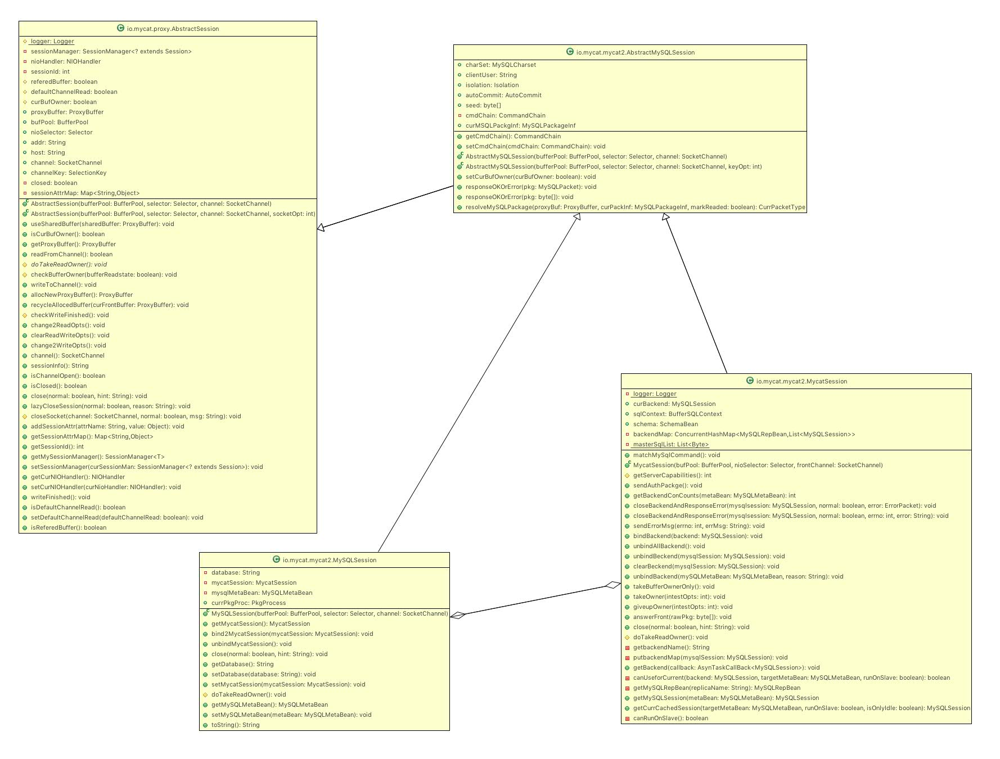
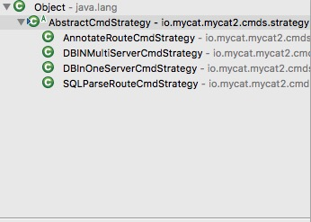
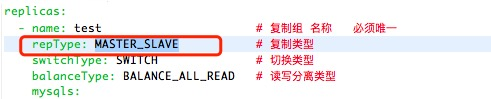
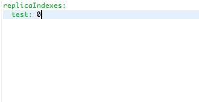
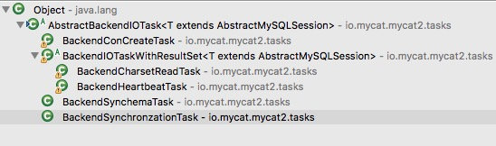
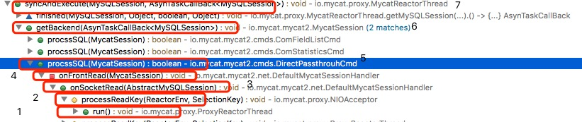

# 前言
   mysql前端链接建立的过程如图所示:
   
  	之前的文章我们分析了第1-6步,这里我们分析第7步.

# 分析
1. 当mycat发送回okPacket后,myclient默认会发送查询版本信息的包,那么由之前的文章可知,该请求会由io.mycat.proxy.ProxyReactorThread,进行处理,该类中有一个线程,会不断的进行事件轮训,那么此时会触发OP_READ事件处理,因此为调用io.mycat.proxy.ProxyReactorThread#processReadKey进行处理.代码如下:
	
	```
	if ((readdyOps & SelectionKey.OP_READ) != 0) {
		this.processReadKey(reactorEnv, key);
	}
	```
	
  而在processReadKey方法中,会调用NIOHandler进行处理,那么**当前的NIOHandler是DefaultMycatSessionHandler**.代码如下:
  
  ```
  	protected void processReadKey(ReactorEnv reactorEnv, SelectionKey curKey) throws IOException {
		// only from cluster server socket
		T session = (T) curKey.attachment();
		reactorEnv.curSession = session;
		session.getCurNIOHandler().onSocketRead(session);
	}
  ```
  
2. 而在io.mycat.mycat2.net.DefaultMycatSessionHandler#onSocketRead中,实现根据session的类型做判断.然后做相应的处理.该类的继承结果如图所示:
	
	
	**如果当前的类是MycatSession,则调用onFrontRead方法,否则调用onBackendRead.很明显,对于当前场景,session是MycatSession的实例.**

3. 在io.mycat.mycat2.net.DefaultMycatSessionHandler#onFrontRead中,做了如下4件事.
	
	1. 首先调用io.mycat.proxy.AbstractSession#readFromChannel,从SocketChannel中读取数据并写入到内部Buffer中,writeState里记录了写入的位置指针,该方法在第一次调用之前需要确保Buffer状态为Write状态，并指定要写入的位置.
	2. 如果没有读到完整报文,则直接return,等待下一次的读取处理.
	3. 调用io.mycat.mycat2.MycatSession#matchMySqlCommand,方法进行处理.根据sql类型构建CmdChain.
	4. 如果当前包需要处理，则交给对应方法处理，否则直接透传.

 代码如下:
 
	 ```
	 	private void onFrontRead(final MycatSession session) throws IOException {
		boolean readed = session.readFromChannel();
		ProxyBuffer buffer = session.getProxyBuffer();
		// 在load data的情况下，SESSION_PKG_READ_FLAG会被打开，以不让进行包的完整性检查
		if (!session.getSessionAttrMap().containsKey(SessionKeyEnum.SESSION_PKG_READ_FLAG.getKey())
				&& (readed == false ||
						// 没有读到完整报文
						MySQLSession.CurrPacketType.Full != session.resolveMySQLPackage(buffer, session.curMSQLPackgInf,
								false))) {
			return;
		}
		if (session.curMSQLPackgInf.endPos < buffer.writeIndex) {
			logger.warn("front contains multi package ");
		}
	    
		session.matchMySqlCommand();

		// 如果当前包需要处理，则交给对应方法处理，否则直接透传
		if(session.getCmdChain().getCurrentSQLCommand().procssSQL(session)){
			session.getCmdChain().getCurrentSQLCommand().clearFrontResouces(session, session.isClosed());
		}
	}
	 ```

3.1 在该方法中的处理逻辑如下:
	
 1. 检查proxyBuffer的状态是否可读,检查curBufOwner是否等于true.代码如下:
 
 ```
  if (!this.proxyBuffer.isInWriting()) {
			throw new java.lang.IllegalArgumentException(
					"buffer not in writing state ");
	}else if(this.curBufOwner==false)
	{//
		logger.info("take owner for some read data coming ..."+this.sessionInfo());
		doTakeReadOwner();
	}
 ```
 2. 根据proxyBuffer的容量做相应的处理,如果proxyBuffer.writeIndex > buffer的容量 * 1 / 3,则进行压缩,否则设置position为proxyBuffer.writeIndex.
 
	> 注意,buffer.position 在有半包没有参与透传时,会小于 writeIndex。大部分情况下 position == writeIndex
	
  代码如下:
  
  ```
ByteBuffer buffer = proxyBuffer.getBuffer();
	if (proxyBuffer.writeIndex > buffer.capacity() * 1 / 3) {
		proxyBuffer.compact();
	} else {
		// buffer.position 在有半包没有参与透传时,会小于 writeIndex。
		// 大部分情况下 position == writeIndex
		buffer.position(proxyBuffer.writeIndex);
	}
  ```
 
 3. 调用java.nio.channels.SocketChannel#read进行数据的读取,如果读取的字节等于-1,则抛出异常,如果等于0,则打印一条异常日志.
否则,将proxyBuffer.writeIndex置为buffer.position.代码如下:

```
int readed = channel.read(buffer);
//		logger.debug(" readed {} total bytes curChannel is {}", readed,this);
	if (readed == -1) {
		logger.warn("Read EOF ,socket closed ");
		throw new ClosedChannelException();
	} else if (readed == 0) {
		logger.warn("readed zero bytes ,Maybe a bug ,please fix it !!!!");
	}
	proxyBuffer.writeIndex = buffer.position();
	return readed > 0;
```

3.3.1 构建io.mycat.mycat2.MycatSession#matchMySqlCommand中,根据schema.schemaType,进行构建CmdChain.代码如下:

```
public void matchMySqlCommand(){
	switch(schema.schemaType){
		case DB_IN_ONE_SERVER:
			DBInOneServerCmdStrategy.INSTANCE.matchMySqlCommand(this);
			break;
		case DB_IN_MULTI_SERVER:
			DBINMultiServerCmdStrategy.INSTANCE.matchMySqlCommand(this);
		case ANNOTATION_ROUTE:
			AnnotateRouteCmdStrategy.INSTANCE.matchMySqlCommand(this);
//			case SQL_PARSE_ROUTE:
//				AnnotateRouteCmdStrategy.INSTANCE.matchMySqlCommand(this);
		default:
			throw new InvalidParameterException("schema type is invalid ");
	}
}
```
 **schemaType可在schema.yml中进行配置,默认是DB_IN_ONE_SERVER.**
 
 3.3.2 在io.mycat.mycat2.cmds.strategy.AbstractCmdStrategy#matchMySqlCommand中处理的逻辑如下:
   
   1. 初始化命令处理链.代码如下:
   
   ```
   		public void clear(){
			target = null;
			queue.clear();
			cmdIndex = 0;
			annontations.clear();
			queueMap.clear();
		}
   ``` 
   2. 根据mysql的报文类型生成MySQLCommand.如果是COM_QUERY,则调用BufferSQLParser进行解析.否则通过MYCOMMANDMAP生成MySQLCommand.最后,如果command等于NULL,则为DirectPassthrouhCmd.代码如下:
   
   ```
MySQLCommand  command = null;
	if(MySQLPacket.COM_QUERY==(byte)session.curMSQLPackgInf.pkgType){
	
		BufferSQLParser parser = new BufferSQLParser();
		int rowDataIndex = session.curMSQLPackgInf.startPos + MySQLPacket.packetHeaderSize +1 ;
		int length = session.curMSQLPackgInf.pkgLength -  MySQLPacket.packetHeaderSize - 1 ;
		parser.parse(session.proxyBuffer.getBuffer(), rowDataIndex, length, session.sqlContext);
		byte sqltype = session.sqlContext.getSQLType()!=0?session.sqlContext.getSQLType():session.sqlContext.getCurSQLType();
		command = MYSQLCOMMANDMAP.get(sqltype);
	}else{
		command = MYCOMMANDMAP.get((byte)session.curMSQLPackgInf.pkgType);
	}
	if(command==null){
		command = DirectPassthrouhCmd.INSTANCE;
	}
   ```
   
   MYCOMMANDMAP的初始化,根据不同的schemaType做不同的处理.其类继承关系如图所示:
   
   
   
   对于当前的情况来说就是DBInOneServerCmdStrategy了.其在初始化是,会首先初始化父类AbstractCmdStrategy.而在其构造方法中,声明如下(采用的是模板方法模式):
   
   ```
   	public AbstractCmdStrategy(){
		initMyCmdHandler();
		initMySqlCmdHandler();
		initStaticAnnotation();
	}
	
	private void initStaticAnnotation(){
			staticAnnontationMap.put(BufferSQLContext.ANNOTATION_SQL_CACHE,new CacheResult());
	}
	
	protected abstract void initMyCmdHandler();
	
	protected abstract void initMySqlCmdHandler();
   ```
   
   而在DBInOneServerCmdStrategy中的实现由于篇幅所限,这里就不贴出了,读者可在如下链接中查看.
   [DBInOneServerCmdStrategy](https://github.com/MyCATApache/tcp-proxy/blob/master/source/src/main/java/io/mycat/mycat2/cmds/strategy/DBInOneServerCmdStrategy.java)
   
   3. 设置原始处理命令.代码如下:
   
   ```
   	session.getCmdChain() .setTarget(command)
			   .processAnnotation(session, staticAnnontationMap)
			   .build();
   ```
   
   其中io.mycat.mycat2.AbstractMySQLSession#CommandChain.processAnnotation方法是处理动态注解和静态注解,其中动态注解 会覆盖静态注解.由于这里暂时不涉及,因次就不贴出代码了.后续会针对sql解析专门写文章分析的.
   
   build方法代码如下:
   
   ```
	public void build(){
		queue = queueMap.values().stream().collect(Collectors.toList());
	}
   ```

3.4 代码如下:

```
if(session.getCmdChain().getCurrentSQLCommand().procssSQL(session)){
		session.getCmdChain().getCurrentSQLCommand().clearFrontResouces(session, session.isClosed());
	}
```
由于当前为DirectPassthrouhCmd因此调用如下io.mycat.mycat2.cmds.DirectPassthrouhCmd#procssSQL方法,代码如下:

```
public boolean procssSQL(MycatSession session) throws IOException {
		/*
		 * 获取后端连接可能涉及到异步处理,这里需要先取消前端读写事件
		 */
		session.clearReadWriteOpts();

		session.getBackend((mysqlsession, sender, success, result) -> {
			ProxyBuffer curBuffer = session.proxyBuffer;
			// 切换 buffer 读写状态
			curBuffer.flip();
			if (success) {
				// 没有读取,直接透传时,需要指定 透传的数据 截止位置
				curBuffer.readIndex = curBuffer.writeIndex;
				// 改变 owner，对端Session获取，并且感兴趣写事件
				session.giveupOwner(SelectionKey.OP_WRITE);
				try {
					mysqlsession.writeToChannel();
				} catch (IOException e) {
					session.closeBackendAndResponseError(mysqlsession,success,((ErrorPacket) result));
				}
			} else {
				session.closeBackendAndResponseError(mysqlsession,success,((ErrorPacket) result));
			}
		});
		return false;
	}
```

处理步骤如下:

1.  首先取消前端读写事件,这是因为获取后端连接可能涉及到异步处理.代码如下:
	
	```
	public void clearReadWriteOpts() {
		this.channelKey.interestOps(0);
	}
	```
2.  获取一个后端链接,然后将命令传递到后端.

3.4.2 首先调用io.mycat.mycat2.MycatSession#getBackend方法获取一个后端链接,然后进行回调.在MycatSession#getBackend方法中,处理步骤如下:
	
1.  首先取得MycatReactorThread,然后获取backendName.根据 backendName获取MySQLRepBean,然后根据读写分离策略获得MySQLMetaBean.如果MySQLMetaBean==null,则发送ErrorPacket包.
2. 根据链接的复用性复用链接,进行sql命令的发送.链接复用性如下:
	* 	当前正在使用的 backend
	* 	当前session 缓存的 backend
	* 	从当前 actor 中获取连接

3.4.1.1 io.mycat.mycat2.MycatSession#getbackendName方法如下,**其默认返回test,可在schema.yml中配置.配置项为-- schemas.defaultDN.replica**:
	
```
private String getbackendName(){
			String backendName = null;
			switch (schema.getSchemaType()) {
				case DB_IN_ONE_SERVER:
					backendName = schema.getDefaultDN().getReplica();
					break;
				case ANNOTATION_ROUTE:
					break;
				case DB_IN_MULTI_SERVER:
					break;
				default:
					break;
			}
			if (backendName == null){
				throw new InvalidParameterException("the backendName must not be null");
			}
			return backendName;
		}

```


3.4.1.2 调用io.mycat.mycat2.MycatSession#canRunOnSlave 方法,判断后端连接 是否可以走从节点.其处理步骤如下:

1. 静态注解情况下 走读写分离
2. 非事务场景下，走从节点

代码如下:

```
private boolean canRunOnSlave(){
		 //静态注解情况下 走读写分离
		if(NewSQLContext.ANNOTATION_BALANCE==sqlContext.getAnnotationType()){
			final long balancevalue = sqlContext.getAnnotationValue(NewSQLContext.ANNOTATION_BALANCE);
			if(TokenHash.MASTER == balancevalue){
				return false;
			}else if(TokenHash.SLAVE == balancevalue){
				return true;
			}else{
				logger.error("sql balance type is invalid, run on slave [{}]",sqlContext.getRealSQL(0));
			}
			return true;
		}

		 //非事务场景下，走从节点
		if(AutoCommit.ON ==autoCommit){
			if(masterSqlList.contains(sqlContext.getSQLType())){
				return false;
			}else{
				//走从节点
				return true;
			}
		}else{
			return false;
		}
	}
```

3.4.1.3 调用 io.mycat.mycat2.beans.MySQLRepBean#getBalanceMetaBean,根据是否可以从读节点读取数据,返回根据读写分离策略要使用的metaBean.处理步骤为:
	
	如果RepType等于SINGLE_NODE 或者 runOnSlave 则返回当前的写节点.否则根据BalanceType,返回节点.
	
由于默认配置为MASTER_SLAVE且runOnSlave等于true,因此进入根据BalanceType的逻辑. RepType可通过datasource.yml进行配置.如图所示:


3.4.1.4 由于默认配置的是BALANCE_ALL_READ,因此会调用io.mycat.mycat2.beans.MySQLRepBean#getLBReadMetaBean,如果从节点不可用,则从主节点获取连接.代码如下:

```
	MySQLMetaBean datas = null;

		switch(replicaBean.getBalanceType()){
			case BALANCE_ALL:
				datas = getLBReadWriteMetaBean();
				break;
			case BALANCE_ALL_READ:
				datas = getLBReadMetaBean();
				//如果从节点不可用,从主节点获取连接
				if(datas==null){
					logger.warn("all slaveNode is Unavailable. use master node for read . balance type is {}", replicaBean.getBalanceType());
					datas = getCurWriteMetaBean();
				}
				break;
			case BALANCE_NONE:
				datas = getCurWriteMetaBean();
				break;
			default:
				logger.warn("current balancetype is not supported!! [{}], use writenode connection .", replicaBean.getBalanceType());
				datas = getCurWriteMetaBean();
				break;
		}
		return datas;
```

而在io.mycat.mycat2.beans.MySQLRepBean#getLBReadMetaBean中只是从metaBeans中过滤出是读节点并且canSelectAsReadNode为true的节点,如果集合为Null,则返回Null,否则随机返回一个节点.代码如下:

```
    private MySQLMetaBean getLBReadMetaBean(){
    	List<MySQLMetaBean> result = metaBeans.stream()
    			.filter(f -> f.isSlaveNode() && f.canSelectAsReadNode())
    			.collect(Collectors.toList());
    	return result.isEmpty() ? null : result.get(ThreadLocalRandom.current().nextInt(result.size()));
    }
```

而canSelectAsReadNode方法的实现如下:

```
public boolean canSelectAsReadNode() {
	int slaveBehindMaster = heartbeat.getSlaveBehindMaster();
	int dbSynStatus = heartbeat.getDbSynStatus();
	
	if (!isAlive()){
		return false;
	}
	
	if (dbSynStatus == DBHeartbeat.DB_SYN_ERROR) {
		return false;
	}
	boolean isSync = dbSynStatus == DBHeartbeat.DB_SYN_NORMAL;
	boolean isNotDelay = (slaveThreshold >= 0) ? (slaveBehindMaster < slaveThreshold) : true;
	return isSync && isNotDelay;
}
```


如果无可用的MySQLMetaBean,则会调用io.mycat.mycat2.beans.MySQLRepBean#getCurWriteMetaBean,逻辑很简单,通过replica-index.yml中的配置取得writeIndex,replica-index.yml如下:



然后判断其是否可用,如果不可用,则返回null,否则返回当前节点.代码如下:

```
    private MySQLMetaBean getCurWriteMetaBean() {
        return metaBeans.get(writeIndex).isAlive() ? metaBeans.get(writeIndex) : null;
    }
```

3.4.1.5 如果targetMetaBean == null,则向客户端发送ErrorPacket,向前端发送还是调用responseOKOrError,该方法之前有分析过,这里就不在赘述了.代码如下:

```
if(targetMetaBean==null){
			String errmsg = " the metaBean is not found,please check datasource.yml!!! [balance] and [type]  propertie or see debug log or check heartbeat task!!";
			if(logger.isDebugEnabled()){
				logger.error(errmsg);
			}
			ErrorPacket error = new ErrorPacket();
            error.errno = ErrorCode.ER_BAD_DB_ERROR;
            error.packetId = 1;
            error.message = errmsg;
			responseOKOrError(error);
			return;
		}
```


3.4.2.1 如果curBackend不等于NULL,并且canUseforCurrent方法返回true,则意味着当前链接可用,因此调用io.mycat.proxy.MycatReactorThread#syncAndExecute进行发送.代码如下:

```
if (curBackend != null
&& canUseforCurrent(curBackend,targetMetaBean,runOnSlave)){
logger.debug("Using cached backend connections for {}。{}:{}"
		,(runOnSlave ? "read" : "write"),
		curBackend.getMySQLMetaBean().getDsMetaBean().getIp(),
		curBackend.getMySQLMetaBean().getDsMetaBean().getPort());
reactorThread.syncAndExecute(curBackend,callback);
return;
}
```

**而在canUseforCurrent中则是通过equals方法进行判断的,注意该equals方法没有进行复写,为什么可以这样呢?这是因为MySQLMetaBean采用的单例模式.**
代码如下：

```
  private boolean canUseforCurrent(MySQLSession backend,MySQLMetaBean targetMetaBean,boolean runOnSlave){
    	
    	MySQLMetaBean currMetaBean = backend.getMySQLMetaBean();
    	    	
    	if(targetMetaBean==null){
    		return false;
    	}

    	if(currMetaBean.equals(targetMetaBean)){
    		return true;
    	}else{
    		return false;
    	}
    }
```

3.4.2.1.1 在io.mycat.proxy.MycatReactorThread#syncAndExecute中,处理步骤如下:

1. 获得MycatSession,并根据MycatSession构建BackendSynchronzationTask. BackendSynchronzationTask的继承结构如下:

	
	
	初始化BackendSynchronzationTask的代码如下:
	
	```
	MycatSession mycatSession = mysqlSession.getMycatSession();
	BackendSynchronzationTask backendSynchronzationTask = new BackendSynchronzationTask(mycatSession,mysqlSession);
	backendSynchronzationTask.setCallback((optSession, sender, exeSucces, rv) -> {
		//恢复默认的Handler
		mycatSession.setCurNIOHandler(DefaultMycatSessionHandler.INSTANCE);
		optSession.setCurNIOHandler(DefaultMycatSessionHandler.INSTANCE);
		if (exeSucces) {
			syncSchemaToBackend(optSession,callback);
		} else {
			ErrorPacket errPkg = (ErrorPacket) rv;
			mycatSession.close(true, errPkg.message);
		}
	});
	```
	
	由继承体系可知,会最终调用io.mycat.mycat2.tasks.AbstractBackendIOTask#setSession,
代码如下:

	```
		public void setSession(T session, boolean useNewBuffer) {
		this.useNewBuffer = useNewBuffer;
		if (useNewBuffer) {
			prevProxyBuffer = session.proxyBuffer;
			session.proxyBuffer = session.allocNewProxyBuffer();
			session.setCurBufOwner(true);
		}
		if (session != null) {
			this.session = session;
			session.setCurNIOHandler(this);
		}
	}
	```
	
	**至此可知,当前的CurNIOHandler为BackendSynchronzationTask.**
2. 调用BackendSynchronzationTask.syncState进行状态同步.其处理步骤如下:
	1. 初始化QueryPacket.
	2. 如果MySQLMetaBean不是从节点,则进行隔离级别同步,提交方式同步
	3. 字符集同步
	4. 调用io.mycat.proxy.AbstractSession#writeToChannel,该方法之前已经分析过了.
	5. 调用io.mycat.mycat2.tasks.AbstractBackendIOTask.finished方法.

代码如下:

```
public void syncState(MycatSession mycatSession,MySQLSession mySQLSession) throws IOException {
        ProxyBuffer proxyBuf = mySQLSession.proxyBuffer;
        proxyBuf.reset();
        QueryPacket queryPacket = new QueryPacket();
        queryPacket.packetId = 0;
        
        queryPacket.sql = "";
        if(!mySQLSession.getMySQLMetaBean().isSlaveNode()){
        	//隔离级别同步
        	if(mycatSession.isolation != mySQLSession.isolation){
                queryPacket.sql += mycatSession.isolation.getCmd();
                syncCmdNum++;
            }
            //提交方式同步
            if(mycatSession.autoCommit != mySQLSession.autoCommit){
                queryPacket.sql += mycatSession.autoCommit.getCmd();
                syncCmdNum++;
            }
		}
        //字符集同步
        if (mycatSession.charSet.charsetIndex != mySQLSession.charSet.charsetIndex) {
            //字符集同步,直接取主节点的字符集映射
            //1.因为主节点必定存在
            //2.从节点和主节点的mysql版本号必定一致
            //3.所以直接取主节点
            String charsetName = mySQLSession.getMySQLMetaBean().INDEX_TO_CHARSET.get(mycatSession.charSet.charsetIndex);
            queryPacket.sql += "SET names " + charsetName + ";";
            syncCmdNum++;
        }
        if (syncCmdNum > 0) {
        	logger.debug("synchronzation state [{}]to bakcend.session={}",queryPacket.sql,mySQLSession.toString());
            queryPacket.write(proxyBuf);
            proxyBuf.flip();
            proxyBuf.readIndex = proxyBuf.writeIndex;
            try {
            	session.writeToChannel();
			}catch(ClosedChannelException e){
				logger.debug("synchronzation state task end ");
				if(session.getMycatSession()!=null){
					session.close(false, "backend connection is closed!");
				}
				session.close(false, e.getMessage());
				return;
			} catch (Exception e) {
				String errmsg = "backend state sync Error. " + e.getMessage();
				errPkg = new ErrorPacket();
				errPkg.packetId = 1;
				errPkg.errno = ErrorCode.ER_UNKNOWN_ERROR;
				errPkg.message = errmsg;
				logger.error(errmsg);
				e.printStackTrace();
				this.finished(false);
				
			}
        }else{
        	finished(true);
        }
    }
    
```


3.4.2.5 在io.mycat.mycat2.tasks.AbstractBackendIOTask#finished中,处理步骤如下:

1. 	 如果useNewBuffer,则调用revertPreBuffer方法.由于在当前场景useNewBuffer等于true,因此会调用revertPreBuffer方法.代码如下:
		```
			protected void revertPreBuffer() {
			session.recycleAllocedBuffer(session.proxyBuffer);
			session.proxyBuffer = this.prevProxyBuffer;
		}
		```
2. 	 io.mycat.mycat2.tasks.AbstractBackendIOTask#onFinished方法.该方法是个空实现,而在BackendSynchronzationTask也没有对该方法进行复写.方法签名如下:
	
	```
		protected void onFinished(boolean success)
	```
3. 	 回调io.mycat.mycat2.tasks.AsynTaskCallBack#finished,对于当前的场景来说,会回调如下代码:

```
(optSession, sender, exeSucces, rv) -> {
			//恢复默认的Handler
			mycatSession.setCurNIOHandler(DefaultMycatSessionHandler.INSTANCE);
			optSession.setCurNIOHandler(DefaultMycatSessionHandler.INSTANCE);
			if (exeSucces) {
				syncSchemaToBackend(optSession,callback);
			} else {
				ErrorPacket errPkg = (ErrorPacket) rv;
				mycatSession.close(true, errPkg.message);
			}
		}
```

处理逻辑如下:
	
1. 恢复默认的Handler,即mycatSession的CurNIOHandler赋值为DefaultMycatSessionHandler,optSession的CurNIOHandler赋值为DefaultMycatSessionHandler.
2. 如果处理成功,则调用syncSchemaToBackend方法,否则, 发送ErrorPacket给前端.而在该方法中的处理逻辑很简单:
	1. 如果mysqlSession.getMycatSession().schema!=null
				&&!mysqlSession.getMycatSession().schema.getDefaultDN().getDatabase().equals(mysqlSession.getDatabase()) ,则进行同步.同步逻辑3.4.2.2 类似.
	2. 如果callback != null,调用io.mycat.mycat2.tasks.AsynTaskCallBack#finished方法.那么此处的会回调我们在io.mycat.mycat2.cmds.DirectPassthrouhCmd#procssSQL中声明的callback,代码如下:

	```
	session.getBackend((mysqlsession, sender, success, result) -> {
				ProxyBuffer curBuffer = session.proxyBuffer;
				// 切换 buffer 读写状态
				curBuffer.flip();
				if (success) {
					// 没有读取,直接透传时,需要指定 透传的数据 截止位置
					curBuffer.readIndex = curBuffer.writeIndex;
					// 改变 owner，对端Session获取，并且感兴趣写事件
					session.giveupOwner(SelectionKey.OP_WRITE);
					try {
						mysqlsession.writeToChannel();
					} catch (IOException e) {
						session.closeBackendAndResponseError(mysqlsession,success,((ErrorPacket) result));
					}
				} else {
					session.closeBackendAndResponseError(mysqlsession,success,((ErrorPacket) result));
				}
			});
	```
	
	该方法的调用链如下:
	
	


    因此,当进行回调时,会执行如下步骤:
    
    1. 切换 buffer 读写状态
    2. 如果成功,则指定透传的数据到截止位置(当不是在透传时需要),改变 owner，对端Session获取，并且注册写事件,调用io.mycat.proxy.AbstractSession#writeToChannel进行报文的发送.
    3. 如果在处理阶段出现异常,则掉用io.mycat.mycat2.MycatSession#closeBackendAndResponseError

    至此,我们的已经分析了第七步的处理,后续文章会分析最后一步.