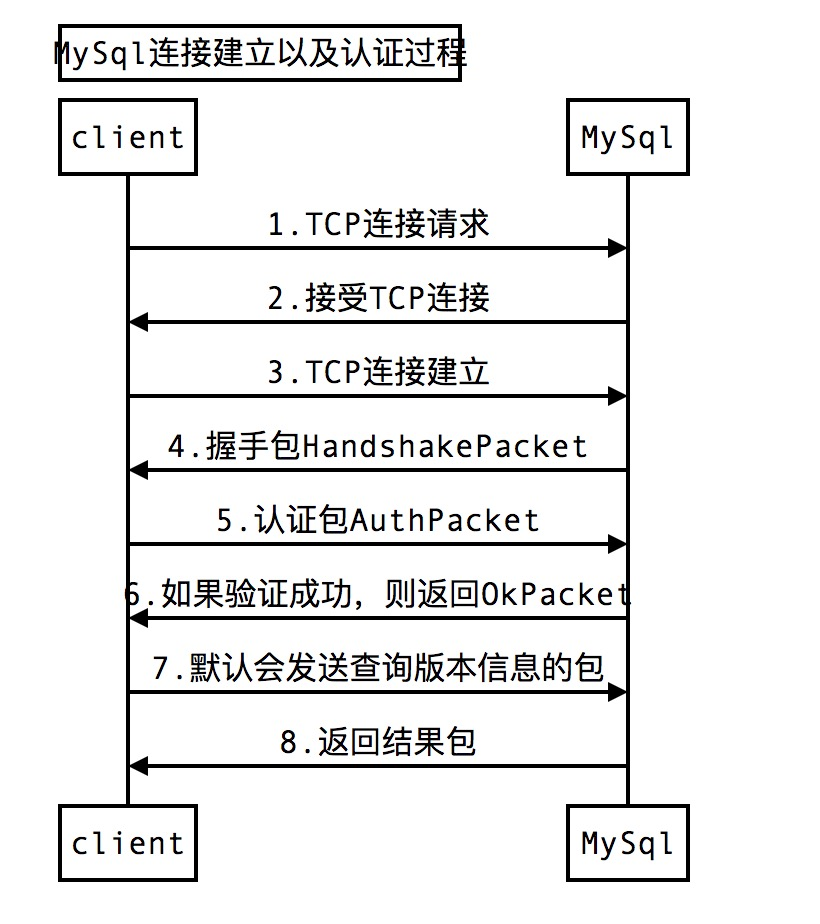
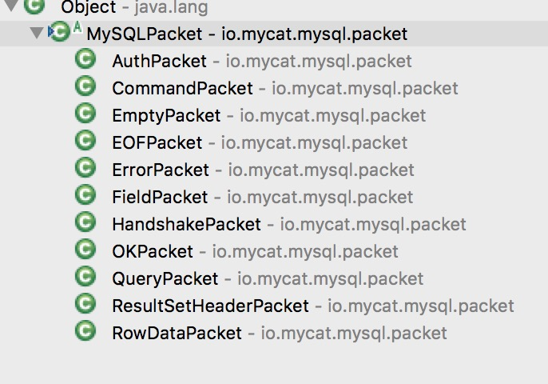

#前言

mycat 前端链接建立的过程如图所示:
 
在之前的三篇中我们看到了io.mycat.mycat2.MycatSession#sendAuthPackge,也就是说第1-3步已经分析过了,在这篇中,我们看第4-6步如何处理.

# 分析

1. 在io.mycat.mycat2.MycatSession#sendAuthPackge中做了4件事了：
	1. 生成认证数据
	2. 保存认证数据
	3. 发送握手数据包
	4. 从内部Buffer数据写入到SocketChannel中发送出去.

  其中第三步初始化了HandshakePacket,该类是mysql协议的实现的一部分,mysql 协议的继承关系如下:
  
  
  
  
  2.在io.mycat.proxy.AbstractSession#writeToChannel中,
  	 
  	 1. 首先调用了io.mycat.proxy.AbstractSession#checkBufferOwner进行状态的检查,如果!curBufOwner 或者this.proxyBuffer.isInReading() != bufferReadstate 则抛出异常,代码如下:
  	 
  	 ```
	  	 protected void checkBufferOwner(boolean bufferReadstate) {
			if (!curBufOwner) {
				throw new java.lang.IllegalArgumentException("buffer not changed to me ");
			} else if (this.proxyBuffer.isInReading() != bufferReadstate) {
				throw new java.lang.IllegalArgumentException(
						"buffer not in correcte state ,expected state  " + (bufferReadstate ? " readable " : "writable "));
			}
	}
  	 ```
  	 
  	 2. 调用java.nio.channels.SocketChannel#write写数据.如果数据全部写完则进入第三步,否则继续注册写事件,直到没有数据可写时结束.
  	 3. 如果数据全部写完,则此时 readIndex等于readLimit,接着如果proxyBuffer.readIndex > buffer.capacity() * 2 / 3,则进行压缩,调用ProxyBuffer#compact,否则调用java.nio.Buffer#limit.代码如下:
  	 
  	 ```
 if (proxyBuffer.readIndex > buffer.capacity() * 2 / 3) {
			proxyBuffer.compact();
		} else {
			buffer.limit(buffer.capacity());
		}
  	 ```
  	 4.调用io.mycat.proxy.AbstractSession#checkWriteFinished,检查数据是否写完.如果readIndex!=readMark则意味着数据还没写完,因此调用io.mycat.proxy.AbstractSession#change2WriteOpts,否则调用io.mycat.proxy.AbstractSession#writeFinished.代码如下:
  	 
  	 ```
	  	 	protected void checkWriteFinished() throws IOException {
			checkBufferOwner(true);
			if (!this.proxyBuffer.writeFinished()) {
				this.change2WriteOpts();
			} else {
				writeFinished();
				// clearReadWriteOpts();
			}
	}
	
 		public void change2WriteOpts() {
			checkBufferOwner(true);
			int intesOpts = this.channelKey.interestOps();
			// 事件转换时,只注册一个事件,存在可读事件没有取消注册的情况。这里把判断取消
		//		if ((intesOpts & SelectionKey.OP_WRITE) != SelectionKey.OP_WRITE) {
				channelKey.interestOps(SelectionKey.OP_WRITE);
		//		}
}

	
  	 ```
  	 
  	 5. 而在change2WriteOpts中,则只是注册了写事件,而在writeFinished中,则会调用io.mycat.mycat2.net.MySQLClientAuthHandler#onWriteFinished方法.
  	 6. 而在MySQLClientAuthHandler#onWriteFinished方法中,首先调用了io.mycat.proxy.ProxyBuffer#flip,切换为读就绪状态,然后注册读事件.

# mycat 前端链接 OP_CONNECT事件处理
 
1. 我们目前为止已经分析完了图中的前4步,那么当TCP链接建立时,就会由io.mycat.proxy.ProxyReactorThread#run方法中对连接事件事件进行处理,就会调用如下方法,进而调用curNIOHandler的onConnect回调,而该回调是个空实现.代码如下:
  
  
  ```
  	@SuppressWarnings("unchecked")
protected void processConnectKey(ReactorEnv reactorEnv, SelectionKey curKey) throws IOException {
	T session = (T) curKey.attachment();
	reactorEnv.curSession = session;
	try {
		if (((SocketChannel) curKey.channel()).finishConnect()) {
			session.getCurNIOHandler().onConnect(curKey, session, true, null);
		}

	} catch (ConnectException ex) {
		session.getCurNIOHandler().onConnect(curKey, session, false, ex.getMessage());
	}
	}
	
	@Override
	public void onConnect(SelectionKey curKey, MycatSession session, boolean success, String msg) throws IOException {
		
	}
  ```


# mycat 前端链接 OP_READ事件处理

1. **目前为止,mycat接受了客户端的链接,并且发送了HandshakePacket报文,那么当客户端发送认证包时,则还是会交由ProxyReactorThread进行处理**,在run方法中,会调用io.mycat.proxy.ProxyReactorThread#processReadKey,在该方法中最终调用了io.mycat.mycat2.net.MySQLClientAuthHandler#onSocketRead方法.代码如下:

```
@SuppressWarnings("unchecked")
protected void processReadKey(ReactorEnv reactorEnv, SelectionKey curKey) throws IOException {
	// only from cluster server socket
	T session = (T) curKey.attachment();
	reactorEnv.curSession = session;
	session.getCurNIOHandler().onSocketRead(session);
}
```

2. 而在MySQLClientAuthHandler#onSocketRead方法中,则做了如下4件事:
	1. 获取ProxyBuffer并解析mysql报文.
	2. 处理用户认证报文
	3. 如果验证成功则返回AUTH_OK,否则返回失败.
	4. 设置NIOHandler为DefaultMycatSessionHandler

	2.1 在io.mycat.mycat2.AbstractMySQLSession.resolveMySQLPackage中
	
	1. 获取了ByteBuffer,根据读取的偏移位置(offset),读取的总长度(读取的总长度)和读取当前的总长度(读取当前的总长度 totalLen= limit - offset)做判断.
		
	2. 如果totalLen == 0,则返回CurrPacketType.ShortHalfPacket,这是因为在透传情况下. 如果最后一个报文正好在buffer 最后位置,已经透传出去了.这里可能不会为零
	
	3. 如果报文没有接受完,则等待下一次读取,否则继续处理.
	4. 解析报文
	5. 如果当前需要跨buffer处理((offset + pkgLength) > limit),则返回CurrPacketType.LongHalfPacket,否则返回CurrPacketType.Full.
	
	代码如下:

	```
		public CurrPacketType resolveMySQLPackage(ProxyBuffer proxyBuf, MySQLPackageInf curPackInf, boolean markReaded)
					throws IOException {
		
				ByteBuffer buffer = proxyBuf.getBuffer();
				// 读取的偏移位置
				int offset = proxyBuf.readIndex;
				// 读取的总长度
				int limit = proxyBuf.writeIndex;
				// 读取当前的总长度
				int totalLen = limit - offset;
				if (totalLen == 0) { // 透传情况下. 如果最后一个报文正好在buffer 最后位置,已经透传出去了.这里可能不会为零
					return CurrPacketType.ShortHalfPacket;
				}
		
				if (curPackInf.remainsBytes == 0 && curPackInf.crossBuffer) {
					curPackInf.crossBuffer = false;
				}
		
				// 如果当前跨多个报文
				if (curPackInf.crossBuffer) {
					if (curPackInf.remainsBytes <= totalLen) {
						// 剩余报文结束
						curPackInf.endPos = offset + curPackInf.remainsBytes;
						offset += curPackInf.remainsBytes; // 继续处理下一个报文
						proxyBuf.readIndex = offset;
						curPackInf.remainsBytes = 0;
					} else {// 剩余报文还没读完，等待下一次读取
						curPackInf.startPos = 0;
						curPackInf.remainsBytes -= totalLen;
						curPackInf.endPos = limit;
						proxyBuf.readIndex = curPackInf.endPos;
						return CurrPacketType.LongHalfPacket;
					}
				}
				// 验证当前指针位置是否
				if (!ParseUtil.validateHeader(offset, limit)) {
					// 收到短半包
					logger.debug("not read a whole packet ,session {},offset {} ,limit {}", getSessionId(), offset, limit);
					return CurrPacketType.ShortHalfPacket;
				}
		
				// 解包获取包的数据长度
				int pkgLength = ParseUtil.getPacketLength(buffer, offset);
				// 解析报文类型
				// final byte packetType = buffer.get(offset +
				// ParseUtil.msyql_packetHeaderSize);
		
				// 解析报文类型
				int packetType = -1;
		
				// 在包长度小于7时，作为resultSet的首包
				if (pkgLength <= 7) {
					int index = offset + ParseUtil.msyql_packetHeaderSize;
		
					long len = proxyBuf.getInt(index, 1) & 0xff;
					// 如果长度小于251,则取默认的长度
					if (len < 251) {
						packetType = (int) len;
					} else if (len == 0xfc) {
						// 进行验证是否位数足够,作为短包处理
						if (!ParseUtil.validateResultHeader(offset, limit, 2)) {
							// 收到短半包
							logger.debug("not read a whole packet ,session {},offset {} ,limit {}", getSessionId(), offset,
									limit);
							return CurrPacketType.ShortHalfPacket;
						}
						packetType = (int) proxyBuf.getInt(index + 1, 2);
					} else if (len == 0xfd) {
		
						// 进行验证是否位数足够,作为短包处理
						if (!ParseUtil.validateResultHeader(offset, limit, 3)) {
							// 收到短半包
							logger.debug("not read a whole packet ,session {},offset {} ,limit {}", getSessionId(), offset,
									limit);
							return CurrPacketType.ShortHalfPacket;
						}
		
						packetType = (int) proxyBuf.getInt(index + 1, 3);
					} else {
						// 进行验证是否位数足够,作为短包处理
						if (!ParseUtil.validateResultHeader(offset, limit, 8)) {
							// 收到短半包
							logger.debug("not read a whole packet ,session {},offset {} ,limit {}", getSessionId(), offset,
									limit);
							return CurrPacketType.ShortHalfPacket;
						}
		
						packetType = (int) proxyBuf.getInt(index + 1, 8);
					}
				} else {
					// 解析报文类型
					packetType = buffer.get(offset + ParseUtil.msyql_packetHeaderSize);
				}
		
				// 包的类型
				curPackInf.pkgType = packetType;
				// 设置包的长度
				curPackInf.pkgLength = pkgLength;
				// 设置偏移位置
				curPackInf.startPos = offset;
		
				curPackInf.crossBuffer = false;
		
				curPackInf.remainsBytes = 0;
				// 如果当前需要跨buffer处理
				if ((offset + pkgLength) > limit) {
					logger.debug("Not a whole packet: required length = {} bytes, cur total length = {} bytes, limit ={}, "
							+ "ready to handle the next read event", pkgLength, (limit - offset), limit);
					curPackInf.endPos = limit;
					return CurrPacketType.LongHalfPacket;
				} else {
					// 读到完整报文
					curPackInf.endPos = curPackInf.pkgLength + curPackInf.startPos;
					if (ProxyRuntime.INSTANCE.isTraceProtocol()) {
						/**
						 * @todo 跨多个报文的情况下，修正错误。
						 */
						final String hexs = StringUtil.dumpAsHex(buffer, curPackInf.startPos, curPackInf.pkgLength);
						logger.debug(
								"     session {} packet: startPos={}, offset = {}, length = {}, type = {}, cur total length = {},pkg HEX\r\n {}",
								getSessionId(), curPackInf.startPos, offset, pkgLength, packetType, limit, hexs);
					}
					if (markReaded) {
						proxyBuf.readIndex = curPackInf.endPos;
					}
					return CurrPacketType.Full;
				}
			}
	```

	2.2. **处理用户认证报文阶段,首先获得UserConfig,该类对应的配置文件为user.yml.如果用户名,密码,数据库,访问权限不满足条件的话,则执行2.3步,进入失败逻辑,否则进入2.4步,进入成功逻辑.**

	2.3 失败逻辑调用的方法是io.mycat.mycat2.net.MySQLClientAuthHandler#failure,该方法主要是初始化了ErrorPacket,并通过io.mycat.mycat2.AbstractMySQLSession#responseOKOrError进行发送.而在responseOKOrError中,最终还是调用了io.mycat.proxy.AbstractSession#writeToChannel将数据真正 的发送出去,代码如下:
	
	```
	public void responseOKOrError(MySQLPacket pkg) throws IOException {
		// proxyBuffer.changeOwner(true);
		this.proxyBuffer.reset();
		pkg.write(this.proxyBuffer);
		proxyBuffer.flip();
		proxyBuffer.readIndex = proxyBuffer.writeIndex;
		this.writeToChannel();
	}
	
	```
	
	2.4 成功逻辑处理:
		
	1. 首先调用了io.mycat.mycat2.net.MySQLClientAuthHandler#success,保存字符集编码和字符集索引.
	2. 调用io.mycat.mycat2.MycatSession#answerFront发送成功报文.代码如下:
	
		```
		public void answerFront(byte[] rawPkg) throws IOException {
			proxyBuffer.writeBytes(rawPkg);
			proxyBuffer.flip();
			proxyBuffer.readIndex = proxyBuffer.writeIndex;
			writeToChannel();
	}
		```
	3. 认证通过，设置当前SQL Handler为DefaultMycatSessionHandler	.