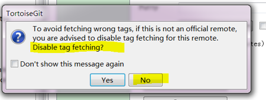
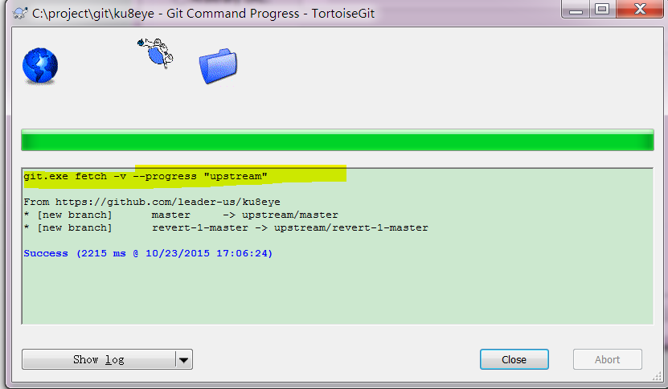
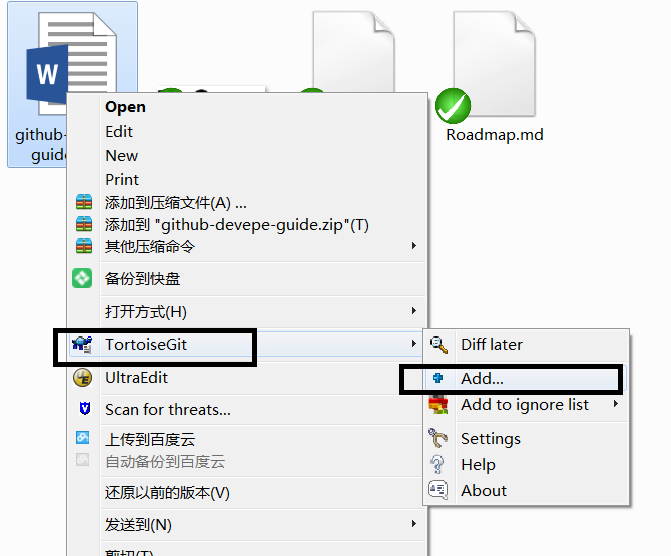

Eclipse中导入maven工程时候，如果公司是代理上网，则需要设置M2插件的代理，这个是在Ecliplse之外的设置，如果是win7系统，则通常在**C:\Users\youaccount\\.m2** 目录下是m2的repository，目录下有repository目录.
在.m2目录下建立settings.xml文档，里面设置代理，内容如下  
```xml
<settings>  
  <proxies>  
    <proxy>  
      <id>my-proxy</id>  
      <active>true</active>  
      <protocol>http</protocol>  
      <host>proxy.xxxx.com</host>  
      <port>8080</port>  
    </proxy>  
    <proxy>  
      <id>my-proxy2</id>  
      <active>true</active>  
      <protocol>https</protocol>  
      <host>proxy.xxxx.com</host>  
      <port>8080</port>  
    </proxy>  
  </proxies>  
</settings>  
```
 
如果是独立的maven，则配置文件应该是在maven的安装目录的conf目录下的setting.xml文件
```xml
<pluginGroups>
</pluginGroups>
<proxies>
<proxy>
<id>my-proxy</id>
<active>true</active>
<protocol>http</protocol>
<host>xxxx</host>
<port>8080</port>
</proxy>
<proxy>
<id>my-proxy2</id>
<active>true</active>
<protocol>https</protocol>
<host>xxxx</host>
<port>8080</port>
</proxy>
</proxies>
```
# 一：fork项目到自己的github账号

#### 1. 点击fork到自己的账号下


#### 2. 查看自己fork项目地址，用户名假如my，则自己的项目地址：[https://github.com/my/ku8eye](https://github.com/my/ku8eye)

# 二：安装客户端工具

- Git-2.6.2-64-bit.exe
- TotoiseGit

# 三：检出项目
#### 1. 如果需要代理上网，则右键菜单TotoiseGit——》Settings——》Network设置代理


#### 2. 文件右键菜单：Git Clone


#### 3. 填入自己Fork的地址，注意不是官方的项目地址


#### 4. 增加官方源地址:upstream


#### 5. 检出的项目的邮件菜单TotoiseGit——》Settings


#### 6. 输入upstream的地址，注意这里是官方的项目地址，点击保存。原来的origin则是你Fork的地址，保持不变。


#### 7. 保存的时候，第一次会提升，防止出错，关闭默认从该地址pull/fetch的功能，我们要点击"No"，即默认从官方源pull/fetch，以同步到我们的本地库中。




#### 8. 接下来会从upstream拉取一次源码：


#### 9. 效果如下：




# 四：提交代码

如果我们本地有代码改变，比如新增文件或代码，流程如下：

Commit（本地提交）->push（提交到自己Fork的地址）->发起pull request(可以工具里或者gihub自己的项目主页里)

#### 1. 比如我们新增了一个文件，右键TotoiseGit –》Add，添加到版本控制文件列表中，然后Commit到本地库里。




#### 2.Commit完成以后可以继续Push，或者以后Push，只有Push到自己Fork地址以后，才是提交到github里了，否则只是本地保存了。

输入自己的用户名密码提交


注意到，目标地址Remoet为Origin地址，即我们自己Fork的地址。
#### 3. Push成功以后，显示如下内容，可以继续发起pull reqest请求，将变更提交到官方源地址(upstream)，请求合并你的变更：


一般是在github网站上发起pull request的，用自己的账号登录github，查看项目变动情况，可以看到自己账号的代码分支比官方源多一个Commit。点击Pull request请求官方合并你的Commit。


发起Pull Request的过程中，可以看到你提交的文件数量，具体文件，以及提交时候的注释内容，有助于官方来确定你的提交是否能被接纳。

# 五：官方Merge请求

#### 1. 所有的Pull request会在官方项目信息里看到


#### 2. 如果没有冲突，则官方会选择合并.


#### 3. 也可能会拒绝，拒绝的话，组好提供详细的拒绝理由，供请求者参考和改进，重新发起Pull。
#### 4. 如果无法自动合并，则表明冲突了，需要发起者同步一次官网最新代码并且Merge以后再提交。

# 六：从官网源同步代码

可以用pull或者fetch两种方式从官网源（upstream）同步代码，fetch是执行了pull +merge的操作，即pull下来与本地的仓库进行merge操作，建议百度更详细的说明。

#### 1. 在自己fork的项目下，可以看到当前版本与官网源的差距，如下图所示：


#### 2. 此次，是可以从官方源fetch/pull最新代码的，如下图所示，Remote选择upstream（官方源）：


#### 3. 可以点击Pulled Diff来查看具体的变化信息：


  